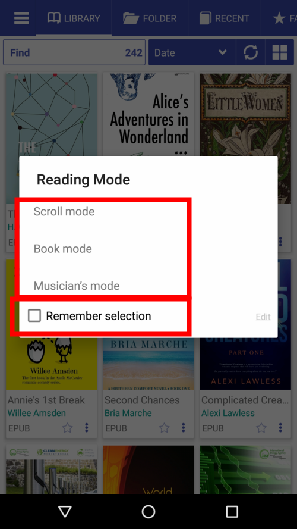
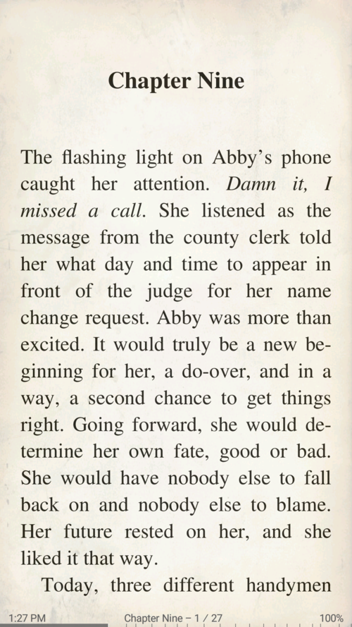
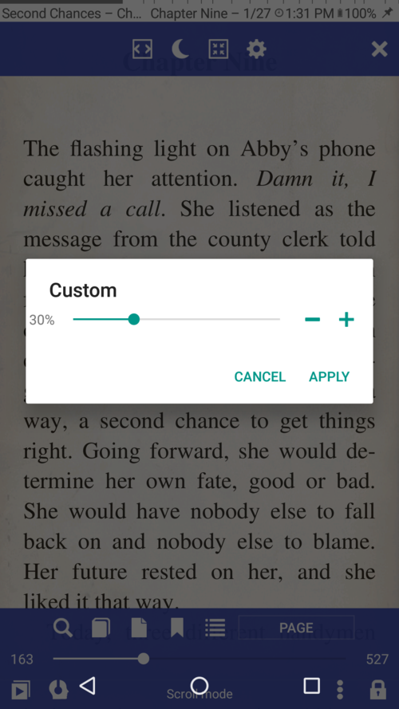
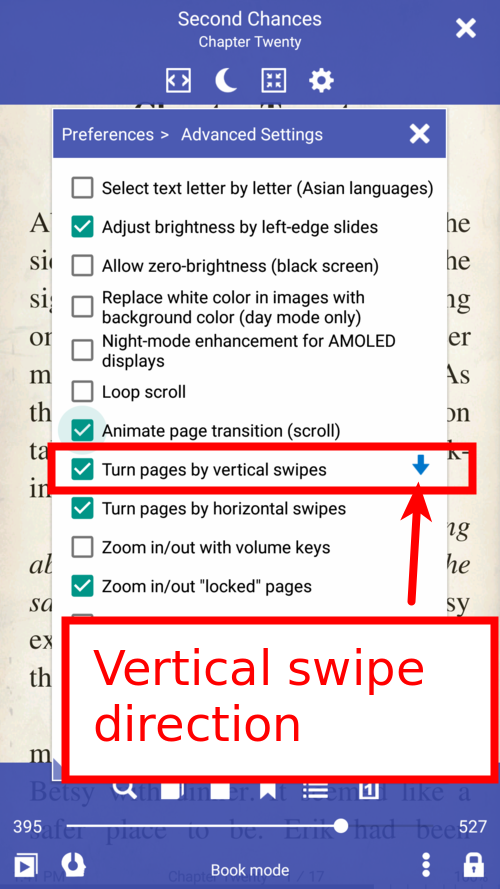
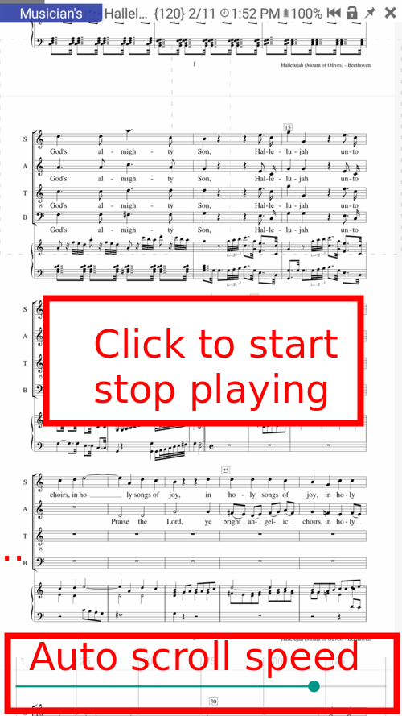
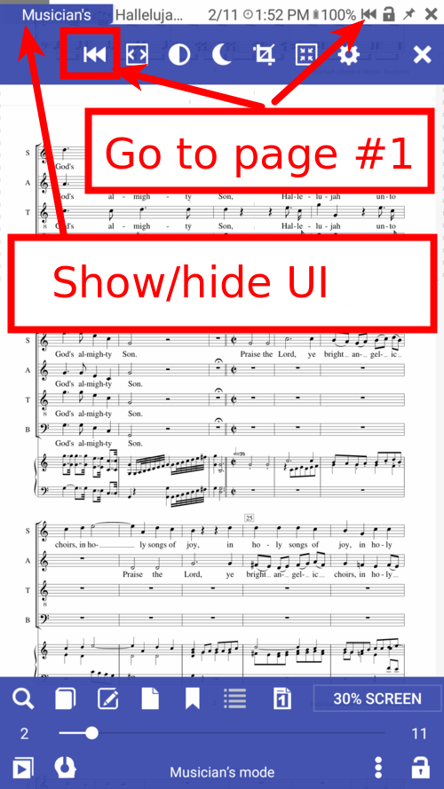

[<](/wiki/faq)

# Modos de leitura: modo de rolagem, modo de livro e modo de músico

&gt; O leitor de livros Librera suporta 3 tipos de modos de leitura. Ver um é melhor para você se decidir.

**O modo de rolagem** é leitura vertical para o documento de rolagem para cima e para baixo.

**Modo de livro** é o modo de leitura horizontal para deslizar as páginas para a direita e para a esquerda.

**O modo músico** é um modo especialmente projetado para músicos.

* Clique no livro para escolher o modo de leitura
* Você pode se lembrar do modo de leitura para futuros livros abertos
* Você pode alterar o modo de leitura no menu à esquerda
* Você pode editar os nomes dos modos de leitura por você
* Long toque em &quot;Editar&quot; para redefinir nomes para nomes padrão

||||
|-|-|-|
||||

* Alterar o modo de leitura do livro
* Clique no painel inferior ou no ícone de menu
* Escolha o modo que você precisa

||||
|-|-|-|
||||

## # Modo de rolagem

* Rolar por páginas, por altura da tela ou por altura do valor personalizado.
* Role com botões de volume, tecla de hardware, pedais Bluetooth, por toque na tela
* Configurar valor personalizado para rolagem

||||
|-|-|-|
||||

## # modo de livro
* Deslize horizontalmente para a página anterior
* Deslize verticalmente para a próxima página anterior
* Alterar a direção do deslize vertical
* Mude as páginas com botões de volume, teclas de hardware, pedais Bluetooth, toque em na tela
* Você pode alterar o tamanho das zonas de toque e a ação da guia, por exemplo, clique no lado esquerdo da próxima página (para pessoas com a mão esquerda)

||||
|-|-|-|
||||

## # modo músico
* Um clique para iniciar ou parar a rolagem / reprodução automática
* Easy next / prev page changing
* Alterar a velocidade de rolagem automática durante o desempenho
* Clique na parte superior para mostrar a interface do usuário com controles de botão
* Ícone para ir para a primeira página (# 1)

||||
|-|-|-|
||||

