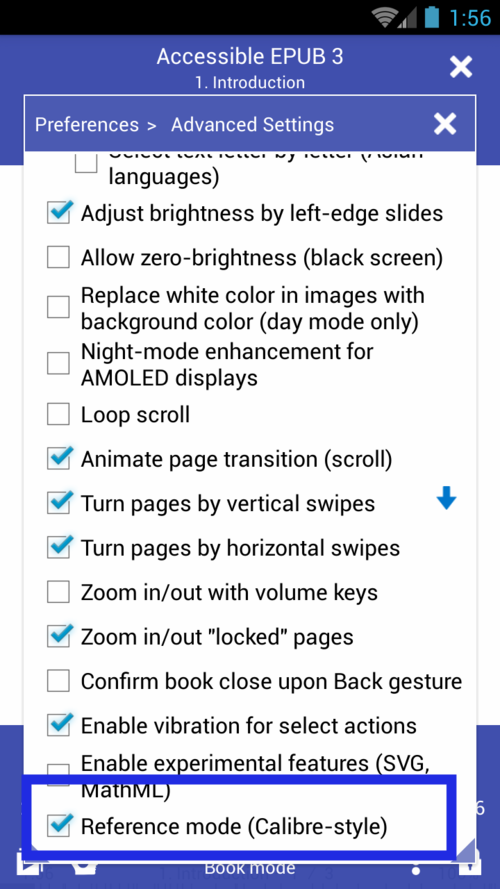
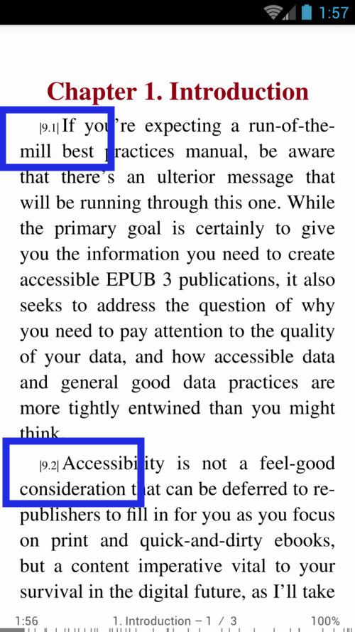

# Mode de référence de style calibre

> Selon un manuel en ligne de **Calibre Viewer**, en **Mode de référence**, un numéro unique sera affiché au début de chaque paragraphe, se référant à ce paragraphe particulier. &quot;Ce nombre est indépendant de la taille de la fenêtre de visualisation ou de la taille de la police.&quot; Les nombres peuvent être utilisés pour cartographier le document, créer une table des matières, mettre en signet, etc.

## Comment activer le mode de référence
* Ouvrez la fenêtre **Préférences** et appuyez sur _Paramètres avancés_ pour ouvrir l'onglet
* Activer le mode de référence en cochant sa case
* Texte avec les _Numéros de référence_ affichés

||||
|-|-|-|
||||
