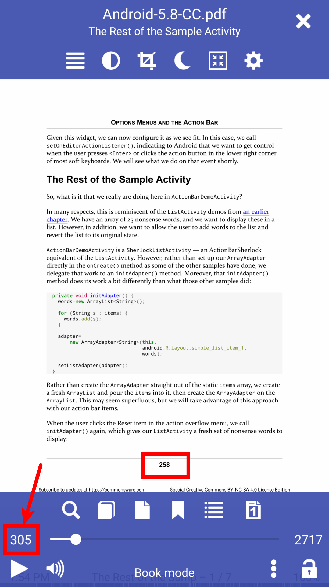
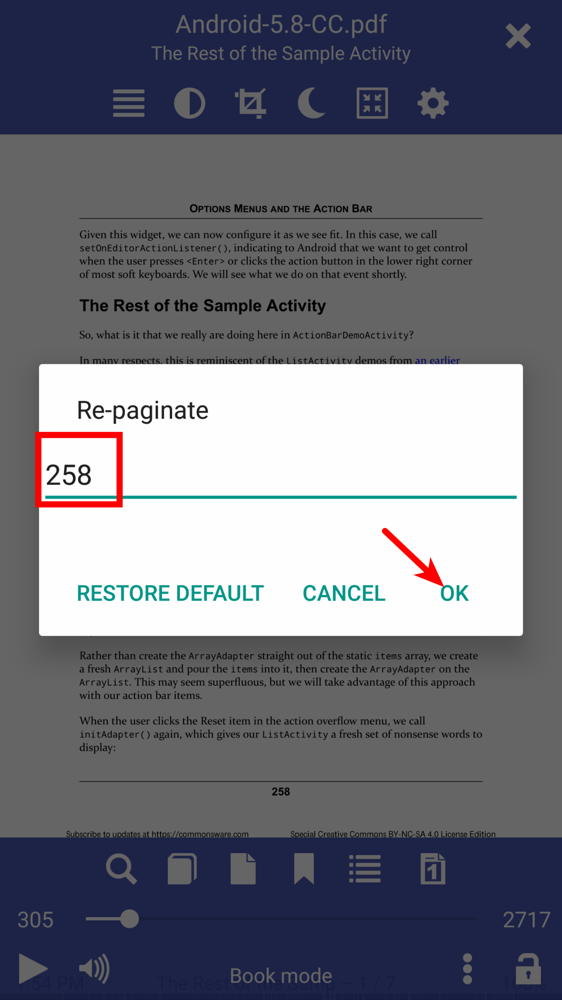
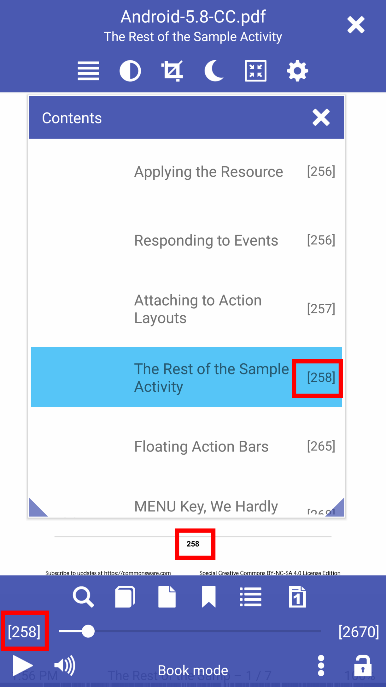

# Volver a paginar su documento para que coincida con los números de página del libro

> Muy a menudo, los libros que estamos leyendo se dividen en partes que tienen su propia paginación, por ejemplo, introducciones, prefacios, prefacios, comentarios, etc. del autor o editor, y el libro en sí comienza bien en el documento. Si tiene notas en el libro que se refieren a páginas particulares, se sentirá frustrado al orientarse dentro del documento. **Librera** le permite volver a paginarlo y hacer que los números de página coincidan con sus notas.

**La paginación funciona para todos los formatos de libros. Pero, por razones obvias, está destinado principalmente a documentos PDF y DjVu.**

* Toque en la pantalla central para abrir el menú
* Mantenga presionado el número de página actual
* Ingrese un número de página coincidente en la ventana **Re-paginate**
* La tabla de contenido del libro se volverá a paginar automáticamente

> Tus marcadores para este libro también volverán a paginar

* Para cancelar el modo de re-paginación, llame a la ventana **Re-paginate** y toque _RESTORE DEFAULT_

|1|2|3|
|-|-|-|
||||
