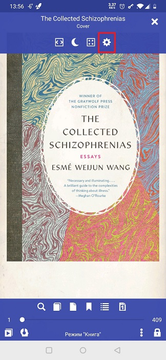
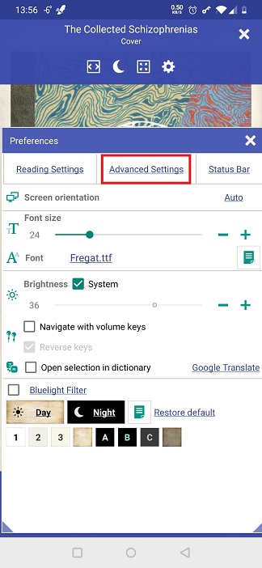
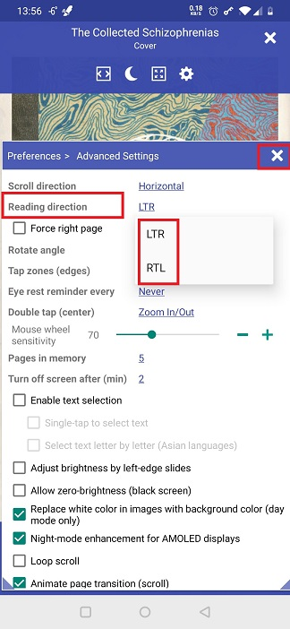

# Lectura en idiomas RTL

> **Librera** se puede adaptar con bastante facilidad para leer textos en idiomas de izquierda a derecha, por ejemplo, árabe, hebreo, farsi o urdu. Solo necesita cambiar la dirección de lectura de su configuración predeterminada de LTR.

Para cambiar la dirección de lectura a RTL:

* Toque el icono **Configuración** para abrir la ventana **Preferencias**
* Abra la pestaña _Configuración avanzada_
* Toque el enlace _Lectura de dirección_ y seleccione _RTL_
* Para ajustar los diseños de dos páginas para la lectura RTL, marque la casilla _Forzar página derecha_

||||
|-|-|-|
||||

||||
|-|-|-|
||||
