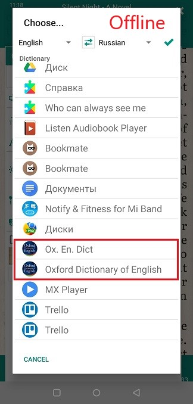
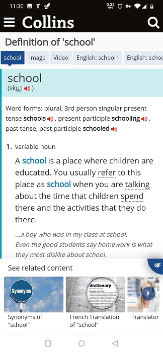
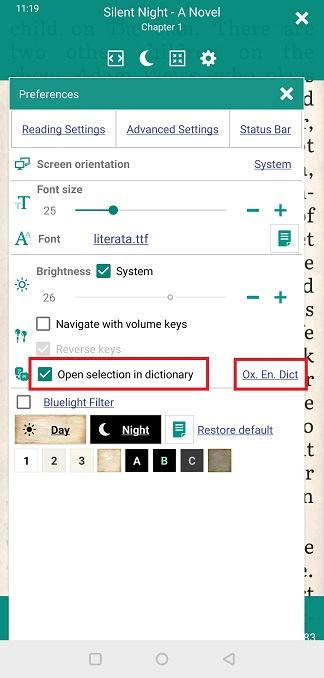

# Setting up and working with dictionaries

> When reading books, you may need to look up the meaning of a word you don't know in a dictionary. Librera allows you to work with many dictionaries, getting information on words in one click.

Librera supports online and offline dictionaries.

* **Online**-without downloading the dictionary to your mobile device, if you have access to the Internet. Information on the meaning of your word will be shown in the Internet browser.
* **Offline**-when the dictionary is downloaded to your mobile device, the information is displayed in the dictionary program or in its pop-up window.

If you have not found the necessary dictionary you can send a proposal to add it to the mail librera.reader@gmail.com or make an issue on github.

||||
|-|-|-|
||||

To configure and select the dictionary you need, you need:
* Click on the settings icon
* Click the "Advanced Settings" tab 
* Click on the reference Name dictionary
* Select your installed offline or online dictionary from the list, swipe up or down. 

This example uses offline dictionaries Google translator and Oxford Dictionary of English.

||||
|-|-|-|
||||

**Working with Online dictionary:**
* Long tap on the word
* Select "Web Dictionary Lookup"
* Select the dictionary to which you want to pass the word. For example let's pass to Collins dictionary.

||||
|-|-|-|
||||

**Working with Offline dictionary:**
* Long tap on the word
* Select the icon of the dictionary you need, for example Oxford Dictionary of English
* If you want to add a shortcut to another dictionary already installed, click the "plus" icon and select it.

||||
|-|-|-|
||||

If you want to skip the dictionary selection, after tap on the word, so that the text is immediately transferred to Your dictionary:

* Put the checkbox on "Open selection in dictionary" and select the dictionary you need.

||||
|-|-|-|
||||

