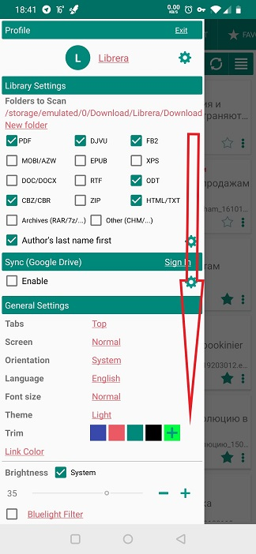

#设置指纹或密码保护

>在**库**中，您可以保护最敏感的文档，防止未经授权的用户查看它们，这些用户可能会意外或以其他方式获得对您设备的访问权限。事实上，由于您限制对应用程序本身的访问，因此您将保护所有文档。
这些文档可以用指纹或密码保护。

##启用启动授权

*关闭您目前正在阅读的书
*点击**首选项**标签，然后向下滚动到“常规设置”面板
*选中“提示输入密码”框
>如果**“首选项”**窗口是动画窗口，则可以通过点击左上角的汉堡包图标或从屏幕左边缘向右轻扫来调用它。

||||
|-|-|-|
||||

##指纹保护

>要在**Librera**中激活指纹保护，您需要首先设置对设备的指纹访问权限。
*在“ **设置密码**”窗口中，选中“允许指纹认证”框
*点击**确定**以确认您的选择

>您需要重新启动**Librera**才能激活指纹访问身份验证。

||||
|-|-|-|
||||

##密码保护

设置密码登录：

*在“ **设置密码**”窗口的相应字段中输入并重新输入密码，然后按**确定**
>密码应该匹配！
*点击**确定**以确认您的选择

>您需要重新启动**Librera**才能使密码保护生效。从这一刻起，在**Librera**中打开文档时，将在空白屏幕上提示您输入密码。

||||
|-|-|-|
||||

>要删除密码/指纹保护，请运行**Librera**，对应用程序进行身份验证，转到_提示输入密码_框，然后取消选中它。
