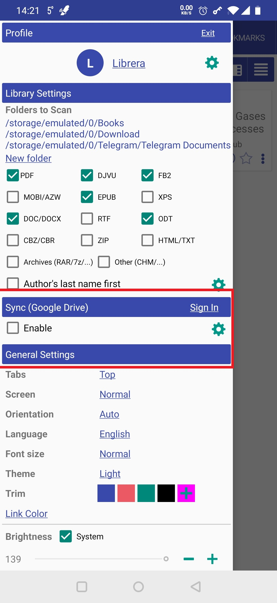
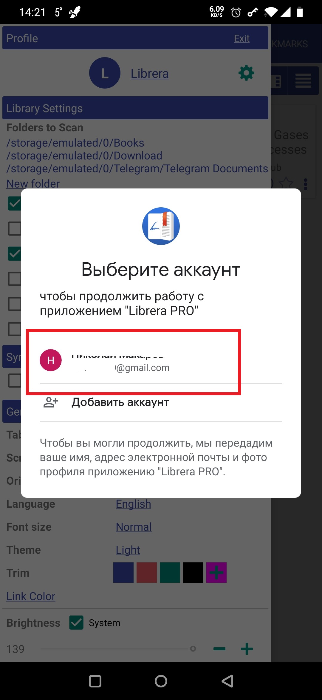
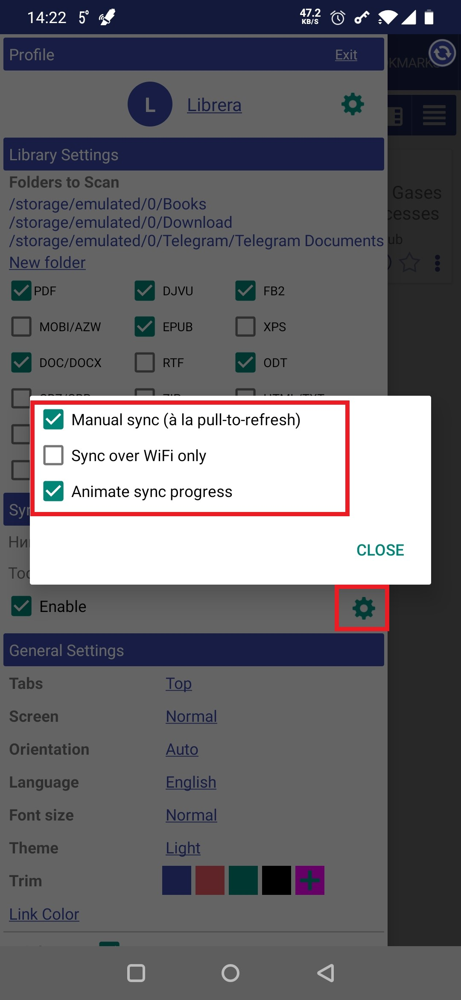
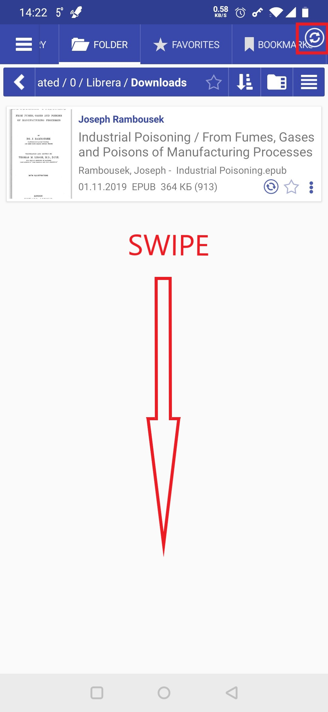

#跨多个设备同步您的阅读设置

> **Librera**配备了一个同步工具，该工具在用户拥有多个Android设备并且倾向于在它们之间交替(偶而偶尔)的情况下会派上用场。使用此工具，您将能够同步**Librera**的个人资料，阅读进度，书签和阅读设置。

为了方便我们的大多数用户，我们选择了Google云端硬盘作为**Librera**的同步中心。

*要启用同步，请转到滑出的“ Preferences_”标签中的“ _Sync_”面板并选中相应的框
*您需要登录自己的Google云端硬盘帐户
 
> **为确保正确的同步，您的其他设备必须登录到同一帐户。**

||||
|-|-|-|
||||

##同步选项

*如果选中了“ _手动同步_”，则需要在屏幕上向下滑动手指才能开始同步(以Android的原生“从上到下刷新”方式)
*您可以通过仅启用WiFi同步来防止同步工具陷入您的数据计划中。
*通过选中此选项，您可以使用同步进度动画(转盘)来娱乐自己
*要查看同步日志，只需点击_Sync_面板中的设置(滚轮)图标

||||
|-|-|-|
||||

>注意：选择Google云端硬盘是为了方便使用。 Google帐户是免费的，任何人都可以使用。如果出于某种原因，您更喜欢其他任何云解决方案，请继续使用它：

> **您只需要将_Librera_文件夹(位于内部存储中)与云同步即可。瞧！**

**PS**对于从在线资源下载的书籍，您可以将它们存储在通过第三方应用程序同步的文件夹中，并将这些文件夹添加到**Librera**的资料库中。
