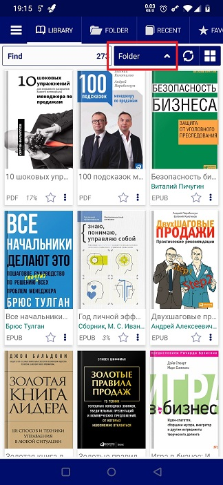

# Sortieren Ihrer Bibliothek nach den letzten Lesungen

> In **Librera** wurde ein neues Sortierkriterium eingeführt: Nach Ihren letzten Lesungen.

* Wechseln Sie zum Tab _Bibliothek_
* Tippen Sie auf die aktuelle Sortieroption, um eine Dropdown-Liste zu öffnen
* Wählen Sie _Neu_ aus.

> Die Bücher, die Sie noch nicht geöffnet haben, werden nicht in der Liste aufgeführt. Das Buch, das Sie gerade lesen, wird oben platziert.

||||
|-|-|-|
||||
