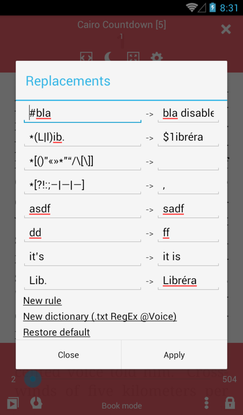
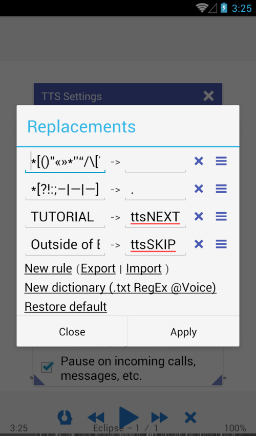

# TTS Replacements

> Text-to-Speech Replacements are used to change the way the engine pronounces certain words, to skip certain characters while reading, or set correct stress marks.

* Enable TTS Replacements
* Show the passage with replacement results
* The **Replacements** dialog for setting replacement rules

|1|2|3|
|-|-|-|
||||

Classic replacements are supported (straightforward change of one string for another), or you can use regular expressions (RegExp).

## Expressions

* "text" - Simple text
* "*text" - * RexExp rule
* "#text" -  disabled rule
* "text256" - disabled rule

## Examples

* "Lib." -> "Librera" - replace Lib. with Librera  
* "Librera" -> "Libréra" - add a correct stress mark
* "#Lib." -> "Librera" - use "#" to disable a rule
* "*(L&#124;l)ib." -> "$1ibrera" - replace Lib. with Librera and lib. with librera
* "*[()"«»*”“/[]]" -> "" - skip chars
* "*[?!:;–|—|―]" -> "," - replace chars with a pause (,)

## TTS Commands

* "text" -> ttsPAUSE - Add pause after "text"
* "text" -> ttsSTOP  - Stop TTS if find "text" in the sentence 
* "text" -> ttsNEXT  - Go to next page if find "text" in the sentence 
* "text" -> ttsSKIP  - Skip reading sentence if find "text" in the sentence

## Add a Rule-File

**Librera** supports RegExp rule-files from **@Voice Reader**
Check out this sample **demo-replaces.txt** below:

```
" живого " "живо́ва"
" как глаза " " как глаза́ "
" мне глаза" " мне глаза́"
" наклоняющая головы" "наклоня́ющая го́ловы"
" никакого стрелка" "никако́во стрелка́"
" ПОЖАРОБЕЗОПАСНУЮ СРЕДУ" "пожарабезопа́сную среду́."
" Стрелки!" "Стрелки́!"
" стрелки?" "стрелки́?"
", все так," ", всё так,"
"Зачем, стрелок?" "Зачем, стрело́к?"
"стрелок?" "стрело́к?"
*"(?i)\b\Q душа в душу\E\b" "душа́ в ду́шу"
*"(?i)\b\Q подогнулись\E\b" "падагну́лись"
*"(?i)\b\Q стрелки почувствовали\E\b" "стрелки́ почувствовали"
*"(?i)\b\Q стрелки продолжили\E\b" "стрелки́ продолжили"
*"(?i)\b\Q стрелку из\E\b" "стрелку́ из"
*"(?i)\b\Q стрелок\E\b" "стрело́к"
*"(?i)\b\Q стрелы\E\b" "стре́лы"
*"(?i)\b\Q*\E\b" "сно́ска"
*"(?i)\b\Q1 курса\E\b" "1-го курса"
*"(?i)\b\Q171 группы\E\b" "171-ой группы"
*"(?i)\b\Q1977\E\b" "1977-ой"
*"(?i)\b\QAcapela\E\b" "Акапэ́'ла"
*"(?i)\b\QBIOS\E\b" "БИ́“О́С"

*"(^| )(Д|д)-р" " доктор"
"(^| )(Г|г)-н" " господин"
*"(\d+)\s?-\s?я\b(?# ""я"" на границе слова)" "$1-я "
```
## Skip Cropped Areas in PDF Documents
> Very often pages in PDF files (books, journal articles, textbooks, etc.) have headers and footers that run throughout the entire document. You can crop the running heads out by two-finger pinch, which will carry on to the next (and previous) pages. But your TTS engine does not have a clue about your manipulations. So, you need to tell it what to do (Skip the annoying thing!) while reading the document out loud to you.

In **Librera** we have introduced special replacements (commands) that will allow you to ignore cropped areas and ensure continuous, uninterrupted reading.
* In the **Replacements** window, enter a word or word sequence in the left column and _ttsSKIP_ as its replacement. This replacement will tell the engine to skip the sentence with this word/word sequence
* Enter a word or word sequence in the left column and _ttsNEXT_ as its replacement. The replacement will tell the engine to skip the sentence with this word/word sequence and immediately go to next page
* Don't forget to hit _APPLY_ to let the replacements hold

|4|5|
|-|-|
|||

> **Please test your changes a few times to make sure everything is working as it should!**

## Read abbreviation as it is

Sometimes the abbreviation TTS is read incorrectly, we can help it read as it is.
```
"*(\w). (\p{javaLowerCase})" "$1 $2"
```
