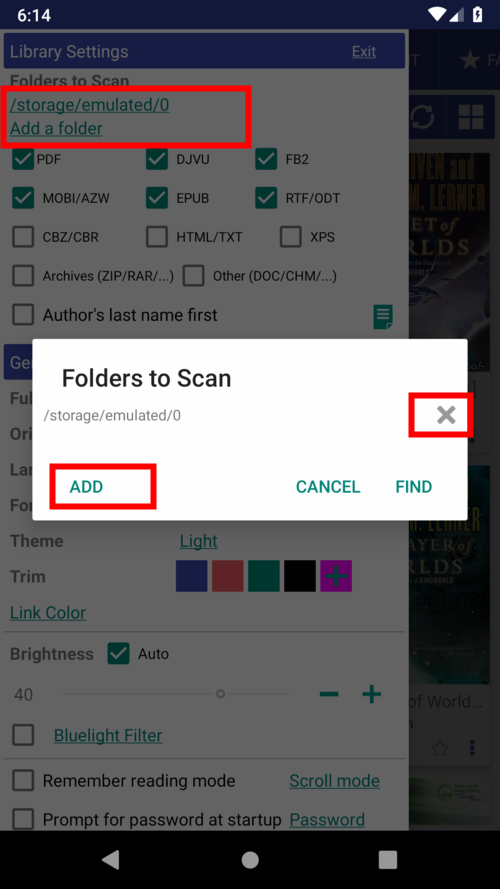
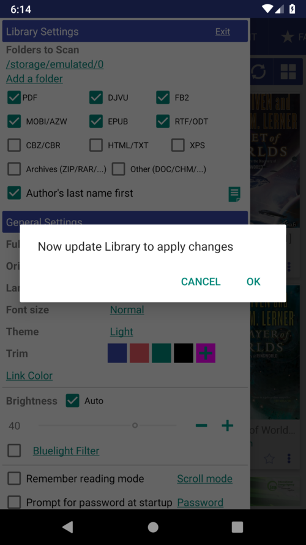

# Actualizando su biblioteca
> Una vez que haya agregado libros a su Biblioteca o eliminado algunas cosas de ella, debe actualizarla para reflejar esos cambios.
* Toque el icono de actualización para comenzar a actualizar la Biblioteca.
* En la pestaña deslizable **Preferencias**, puede especificar algunas carpetas adicionales para **Librera** para buscar libros.
* También puede eliminar carpetas completas de la lista de las que se escaneará en busca de libros.
* Una vez que haya realizado cambios en la lista de tipos de archivos elegibles, aparecerá un mensaje en un par de segundos para que confirme los cambios.

|1|2|3|
|-|-|-|
||||

> Nota: **Librera** puede escanear las carpetas creadas para los libros descargados de los recursos de libros en línea. Puede sincronizar esas carpetas en múltiples dispositivos usando aplicaciones de terceros.
