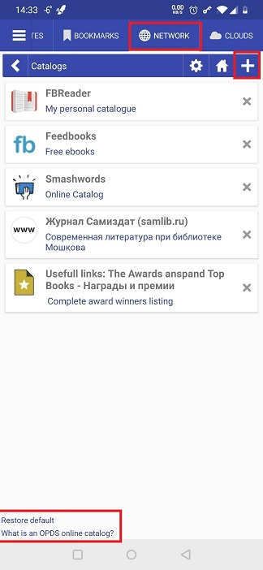
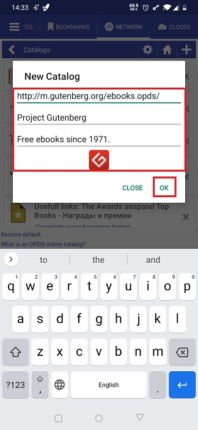
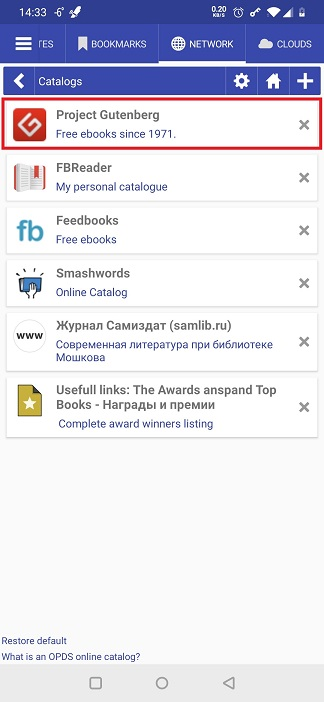
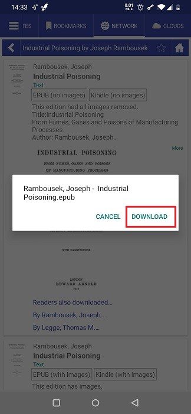
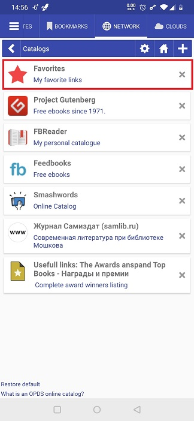
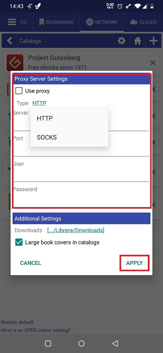
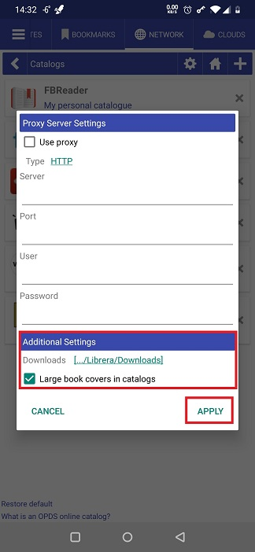

# Trabajar con catálogos OPDS

> El formato Open Publication Distribution System (OPDS) es un formato de sindicación para publicaciones electrónicas. Los catálogos OPDS permiten la agregación, distribución, descubrimiento y adquisición de publicaciones electrónicas (Wikipedia).

**Librera** permite al usuario abrir catálogos OPDS, usar sus motores de búsqueda para navegar dentro de ellos y descargar libros de ellos.

## Abrir un catálogo
* **Librera** viene con una lista preconfigurada de catálogos en la pestaña _Networks_
* Toque un elemento de la lista para abrir un catálogo (algunos de ellos requieren registro, así que asegúrese de que ya se haya registrado con ellos)

## Agregar un catálogo a la lista
* Toque el icono de agregar (**+**) para abrir el cuadro de diálogo _Nuevo Catálogo_
* Ingrese la dirección del catálogo y su nombre y descripción (opcional), y luego toque _ADD_
> **Librera** abrirá este diálogo nuevamente si falla la conexión. Marque la casilla _Agregar como sitio WEB_ e intente nuevamente

**Para eliminar todos los catálogos OPDS que ha agregado a la lista original, toque el enlace _Restore default_ en la parte inferior**

||||
|-|-|-|
||||

||||
|-|-|-|
||||

## Descargar un libro de un catálogo OPDS
* Navega hasta el libro que deseas descargar
* Seleccione el formato de libro deseado tocándolo
* Confirma la descarga
* Se resaltará la entrada del libro que acaba de descargar.
* Abre el libro y disfruta

||||
|-|-|-|
||||

## Agregar directorios en los catálogos OPDS a favoritos
* Navegue a su directorio favorito en un catálogo OPDS
* Toque el ícono de estrella (favoritos)
* Realizar cambios significativos en el nombre
* Confirme la adición a la lista tocando _ADD_
* El directorio aparecerá en la lista de catálogos

||||
|-|-|-|
||||

## Cambiar la configuración
* Toque el icono de configuración
* Puede enrutar la conexión a los catálogos OPDS a través de un servidor proxy especificado en el panel _Proxy Server Settings_ de la ventana de configuración
* Puede cambiar la carpeta para sus descargas desde los catálogos OPDS
* Si prefiere ver portadas de libros grandes mientras navega por los catálogos, marque la casilla correspondiente

||||
|-|-|-|
||||
