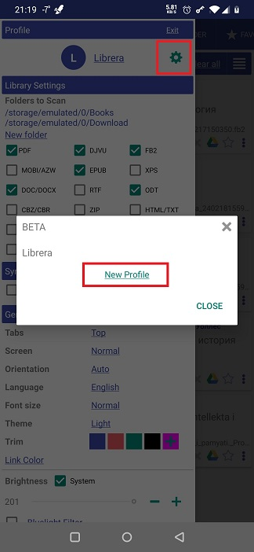
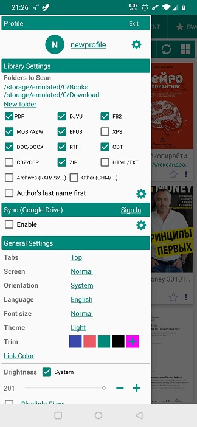
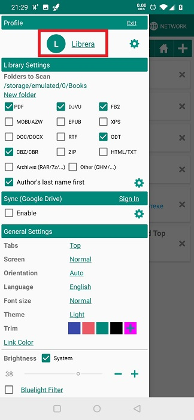
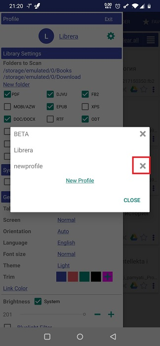
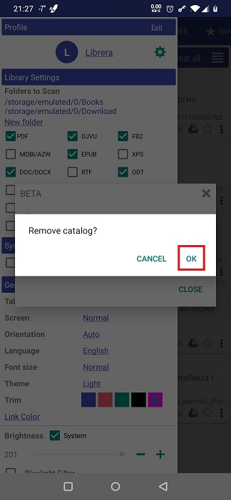

# Mit _Librera_s Profilen arbeiten

> **Mit Librera** können Sie mehrere Profile erstellen. Sie können eine für alles hinzufügen, von Tag/Nacht-Lesen zu Stimmungsschwankungen, Buchgenres zu Ihrer besonderen Einstellung zu einem bestimmten Schriftsteller usw.
> Und denken Sie daran: Ein anderes Profil (das Sie aufheitern könnte) ist nur ein paar Klicks entfernt (von Ihrem aktuellen).

## Hinzufügen eines neuen Profils
* Wechseln Sie zum Tab **Einstellungen** und tippen Sie auf das Einstellungssymbol im Bereich _Profil_ (ganz oben).
* Tippen Sie im Fenster mit der Profilliste auf den Link _Neues Profil_
* Geben Sie einen aussagekräftigen Namen für das neue Profil ein und fügen Sie ihn der Liste hinzu
* Jetzt können Sie die Benutzeroberfläche und die Leseeinstellungen für Ihr neues Profil konfigurieren

||||
|-|-|-|
||||

## Profile wechseln
* Tippen Sie im Bereich _Profile_ des Tabs **Einstellungen** auf den aktuellen Profilnamen
* Wählen Sie in der Dropdown-Profilliste ein Profil aus, zu dem Sie wechseln möchten
* Bestätigen Sie die Profilumschaltung in einem Popup-Dialogfeld und genießen Sie

||||
|-|-|-|
||||

## Zurücksetzen eines Profils
> Wenn Sie die Einstellungen Ihres aktuellen Profils auf ihre ursprünglichen (Standard-) Werte zurücksetzen müssen, sollten Sie die folgenden einfachen Schritte ausführen:
* Drücken Sie lange auf Ihren aktuellen Profilnamen im Bereich _Profile_ des Tabs **Einstellungen**
* Bestätigen Sie Ihre Absicht in einem Popup-Dialogfeld, indem Sie auf _OK_ tippen.

**Hinweis: Ihre Lesezeichen, Tags und Lesevorgänge werden nicht gelöscht oder zurückgesetzt!**

||||
|-|-|-|
||||

## Löschen eines Profils
> Hinweis: Sie müssen zu einem anderen Profil wechseln, bevor Sie Ihr aktuelles löschen können.

* Tippen Sie im Bereich &quot;Profil&quot; des Fensters **Einstellungen** auf das Einstellungssymbol
* Klicken Sie auf das _X_ neben dem Profil, das Sie löschen möchten
* Bestätigen Sie den Löschvorgang, indem Sie auf _OK_ tippen.

||||
|-|-|-|
||||
