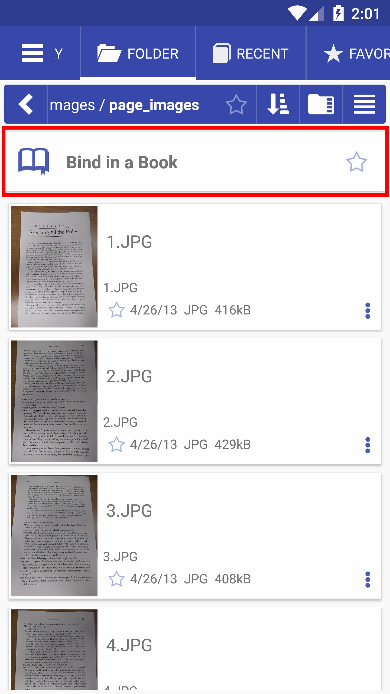
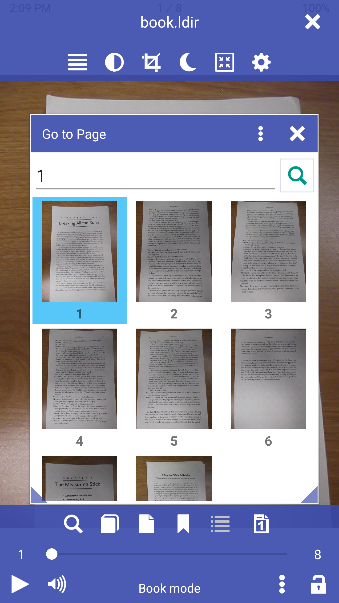
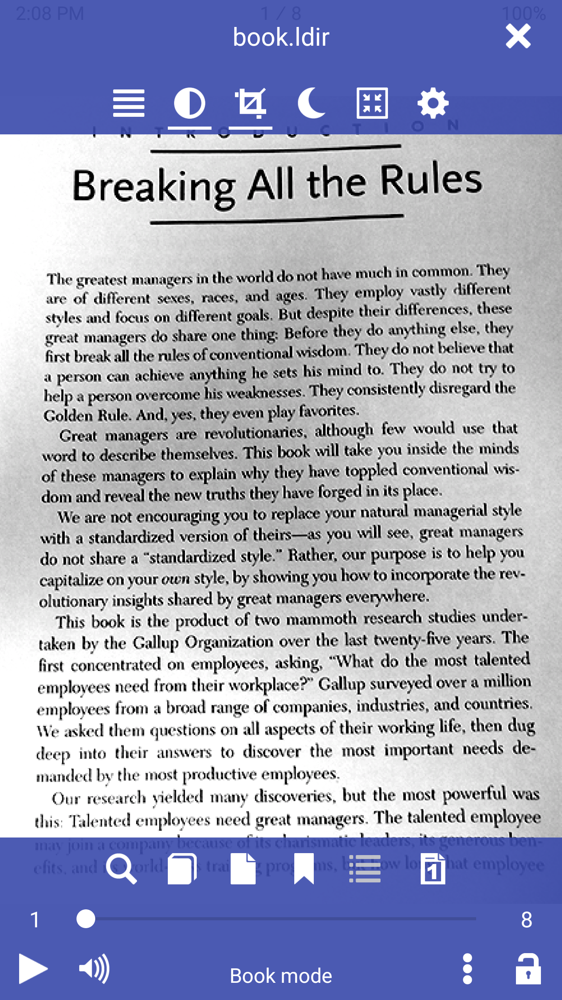

[<](/wiki/fr)

# Ouvrir le dossier avec les images sous forme de livre (Lié dans un livre/fr)
Il est facile d&#39;ouvrir n&#39;importe quel dossier avec des images, comme un livre virtuel dans l&#39;application Librera.

* Ouvrir un dossier avec des images et le lier dans un livre
* Dossier avec des images comme un livre virtuel
* Ajoutez des bordures blanches, du contraste et de la luminosité

||||
|-|-|-|
||||

