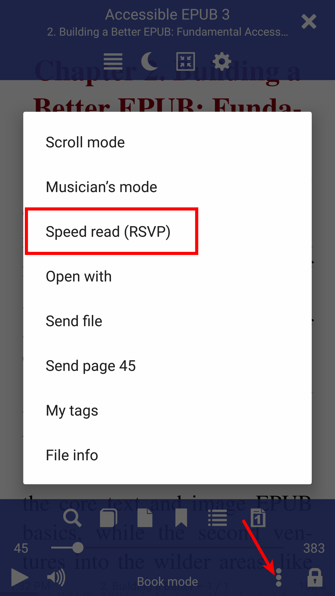
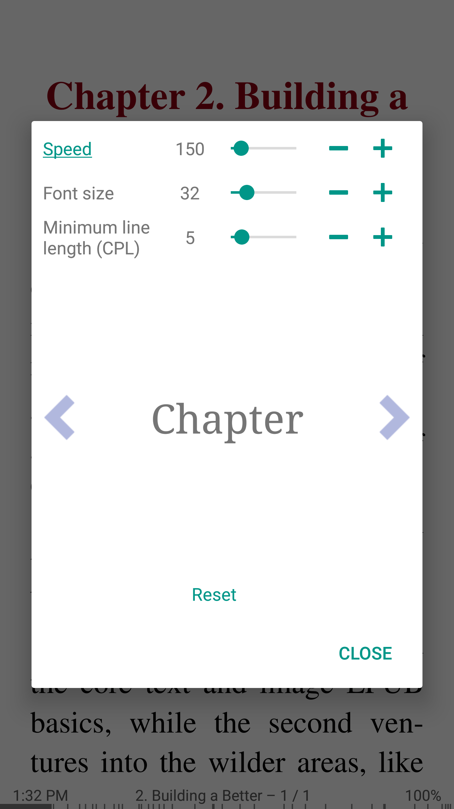
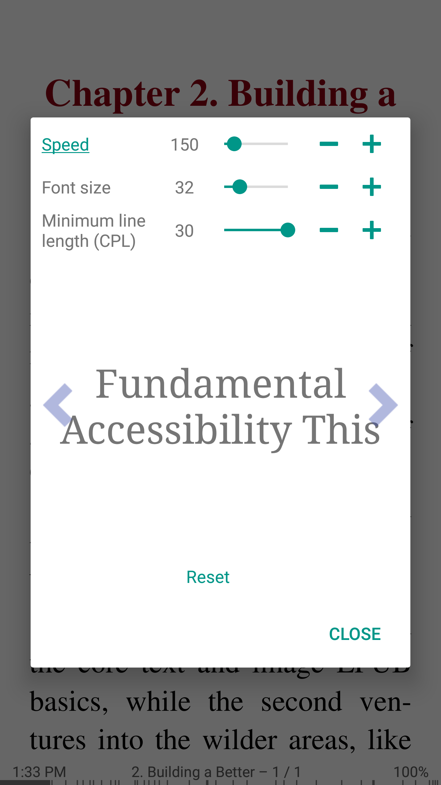

[<](/wiki/ar)

# سرعة القراءة RSVP (العرض التقديمي التسلسلي السريع) في Android

> * العرض المرئي التسلسلي السريع * هو نموذج تجريبي يُستخدم بكثرة لفحص الخصائص الزمنية للاهتمام. يتطلب نموذج RSVP من المشاركين إلقاء نظرة على العرض المرئي للعناصر المرئية التي تبلغ حوالي 10 عناصر في الثانية. تظهر جميعها في نفس المكان. يتم وضع الأهداف داخل هذا التدفق من العناصر المستمرة. فهي منفصلة عن بقية العناصر المعروفة باسم التشتت. يمكن أن تكون التشويش إما تغيير اللون أو يمكن أن تكون الحروف بين الأرقام.

مع قارئ الكتب Librera يمكنك القراءة بشكل أسرع باستخدام هذه الطريقة.
يمكنك تغيير سرعة قراءة الكلمات في الدقيقة (wpn) في الوقت الحقيقي.
كما يمكنك تغيير حجم النص والانتقال إلى الكلمات السابقة.
بنقرة واحدة لبدء قراءة سرعة التوقف.

Librera يضيف ميزة جديدة unic هو __طول خط الحد الأدنى__ في charactes لكل سطر (CPL).

يعرض RSVP الكلاسيكي كلمة واحدة فقط لكلٍ مثل الجملة على سبيل المثال &quot;أنا طبيب&quot;

__0 CPL__ - 1/ar) &quot;I&quot; 2/ar) &quot;am&quot; 3/ar) &quot;a&quot; 4/ar) &quot;doctor&quot; (4 أسطر/ar)

مع Librera يمكنك تكوين cofigure على سبيل المثال دقيقة 3 CPL

__3 CPL__ 1/ar) &quot;أنا&quot; 2/ar) &quot;طبيب&quot; (خطان/ar)

__10 CPL__ 1/ar) &quot;أنا طبيب&quot; (سطر واحد/ar)

* يمكن فتح RSVP من قائمة الكتب
* بنقرة واحدة لتبدأ القراءة السريعة
* 30 عينة CPL

||||
|-|-|-|
||||

