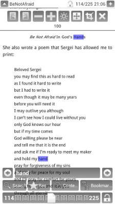
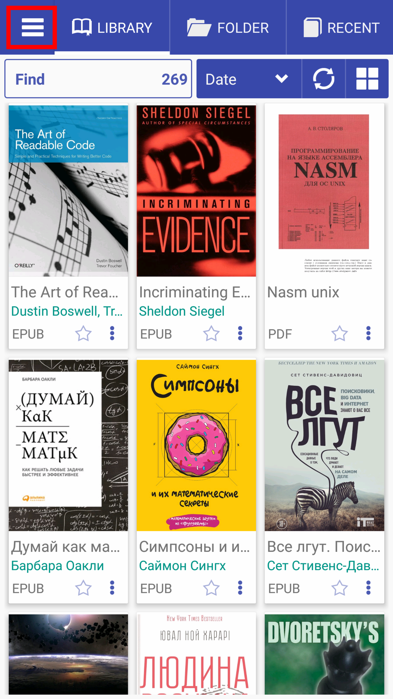
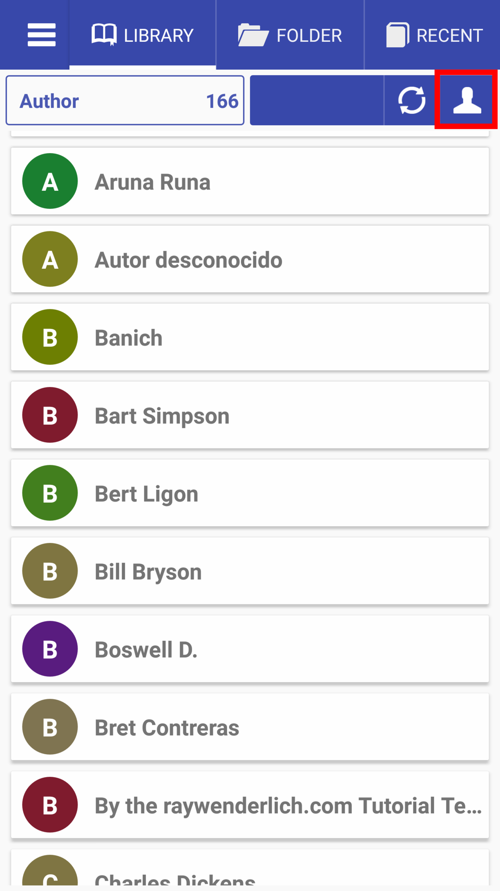

[<](/wiki/guide-ru/)

# Черновик

### История создания читалки
Первая версия читалки была создада за один месяц работая по вечерам примерно в 2012 году. Я любил читать PDF книги и умел программировать.
В то время было очень мало читалок которыми бы можно было читать PDF книги а тем более с расширенными возможностями.
Главным недостатком всех их, было отсутсвие фиксации старниц от сдигов в стороны, для удобного листания в стороны, не было хорошей поддержки 
eink устройств и физических клавиш.
Не долго думая, я решил попробвоать сделать для себя небольшое PDF приложение с этими возможностями.

В то время на рынке было несколько доступных программ с отркытым кодом, сперва чилалка была сделана на движке  VuDroid а потом переписана
на движок EBookDroid. Я хотел внести только необходимые мне изменнеия, но потом решил добавить несоклько особенностей
Поиск всех книг, просмотр папок, предосмотр картинок. Главное окно выполнено ввиде вкладок, и с такой же идеей интерфейса программа и по сей день.

||||
|-|-|-|
|||

__Вот пример описания того описания:__ [найдено здесь](http://androidar.ru/646-pdf-reader.html)

> Главное окно приложения состоит из нескольких вкладок. В первой отображаются все найденные на устройстве файлы. Их можно отсортировать несколькими способами: по пути, по имени, по размеру, по дате.
Вторая вкладка приложения PDF Reader для Android представляет собой файловый менеджер, позволяющий просматривать содержимое файловой системы устройства.
Третья вкладка содержит список недавно открытых книг. Удалить из этого списка файл очень просто —достаточно нажать на красный крестик справа.
Четвертая книга содержит сделанные пользователем закладки. Благодаря этому вы всегда сможете найти свои заметки.
Последняя, пятая, вкладка — это настройки, которые позволяют изменить тему оформления со светлой на темную, указать ориентацию экрана (системную, горизонтальную, вертикальную), включить отображение на полный экран.

>__PDF Reader для Android__ отлично, быстро и без тормозов, отображает файлы. 
Вверху окна чтения находится строка заголовка, содержащая название файла, кнопку отображения наэкранных кнопок, кнопку фиксации размера страницы, кнопку скрытия этой строки.
Наэкранные кнопки позволяют оперировать следующими функциями:

- выравнивание страницы книги вправо или влево;
- увеличить или уменьшить масштаб;
- включить ночной режим, при котором текст становится белым, а фон страницы темным, что удобно в условиях невысокой освещенности;
- включить или отключить режим полного экрана;
- обрезать страницу по краям (удобно, когда у страниц книги большие поля, при активации этой опции остается только текст);
- закрыть книгу;
- перелистывание страниц;
- доступ к поиску, содержанию, добавлению закладок.

Программа поддерживала два формата PDF и DJVU и называлась просто __PDF Reader__ 

Потом автор выложил приложение на Google Play Market и стал в свободное время добавлять пожелания пользователей, которым приложение
пришлось по душе.

Открытым код читалки находится на [GitHub](https://github.com/foobnix/LibreraReader) и любой желающий может помочь с развитием проекта, переводам.
Множество пожеланий от разных было добавлено за последние годы.

Так появился музыкальный режим, два режима чтения - вертикальный и горизонтальный и множество других настроек.

# Современная читалка

* Вкладка "Библиотека" - отображает все найденные книги на устройсве в избранных папках. 
Поиск может рабоать как на внутренней памяти так и на внешней
* "Левое меню" - настройки библиотеки, отображения, обложек, и другое.
* Три базовых режима чтения книг

||||
|-|-|-|
|||

### Вкладка "Библиотека"

* Выбор отображения книг как "Спосок", "Две колонки", "Сетка", "Обложки"
* Поиск фильтр среди найденных книг, отображеет кол-во найденных позиций
* Сортировка книг в библиотеке по "Дате", "Имени", "Заголовку", "Автору", "Названию серии", "Номеру серии"

||||
|-|-|-|
|||

* Выбор отображения книг как "Спосок", "Вде колонки", "Сетка", "Сетка без подписей"
* Поиск фильтр среди найденных книг, отображеет кол-во найденных позиций
* Сортировка книг в библиотеке по "Дате", "Имени", "Заголовку", "Автору", "Названию серии", "Номеру серии"

||||
|-|-|-|
|||

* Отображение всех авторов
* Книги по автору, серсии книг этого автора
* Жанры книг и логические блоки отображения информатции в библиотеке

||||
|-|-|-|
|||
 

