[<](/wiki/stories/es)

# Ventana principal de aplicacion

> La pestaña Biblioteca o la biblioteca es la vista principal de la aplicación.

* Ficha Biblioteca: muestra todos los libros que se encuentran en el dispositivo
* Cambie el orden por datos, tamaño de archivo, autor, etc.
* Cambia el tipo de vista por Lista, Cuadrícula, Cubiertas.

||||
|-|-|-|
|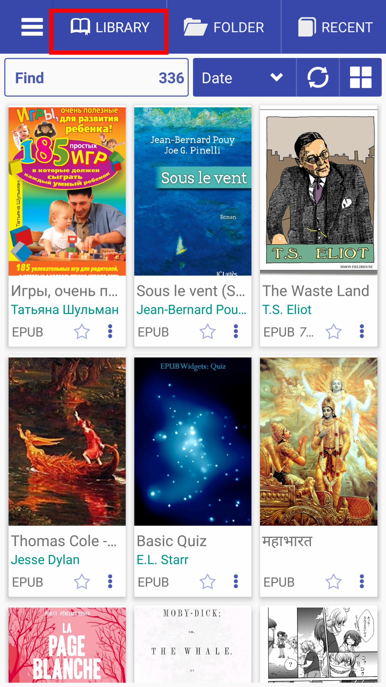|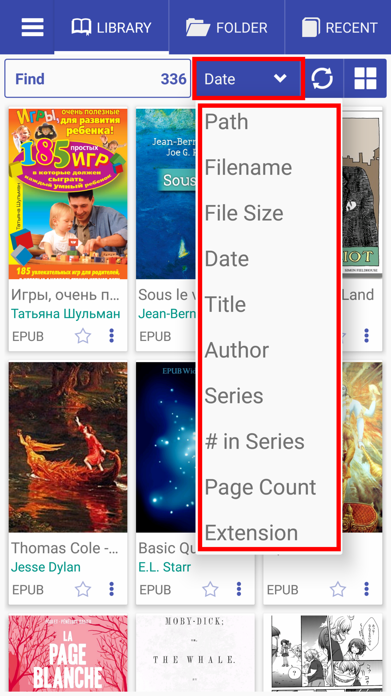|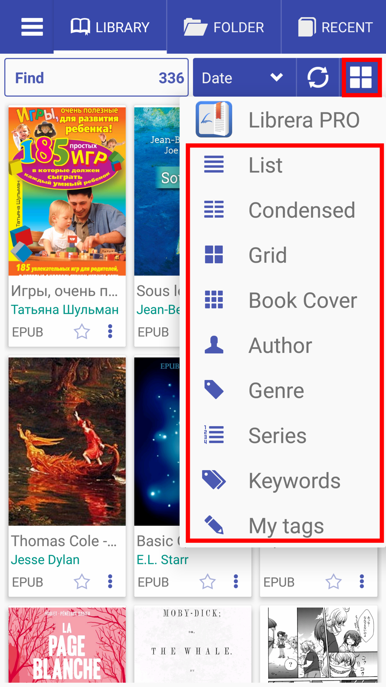|

* Vista de dos columnas
* Vista en cuadrícula
* Vista de portadas

||||
|-|-|-|
|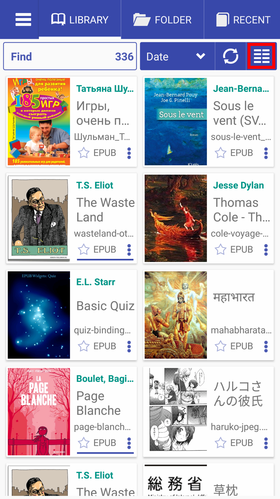|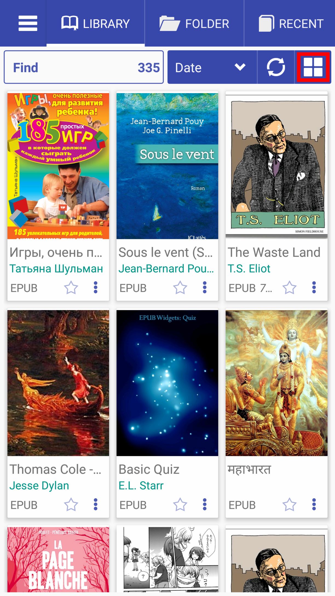|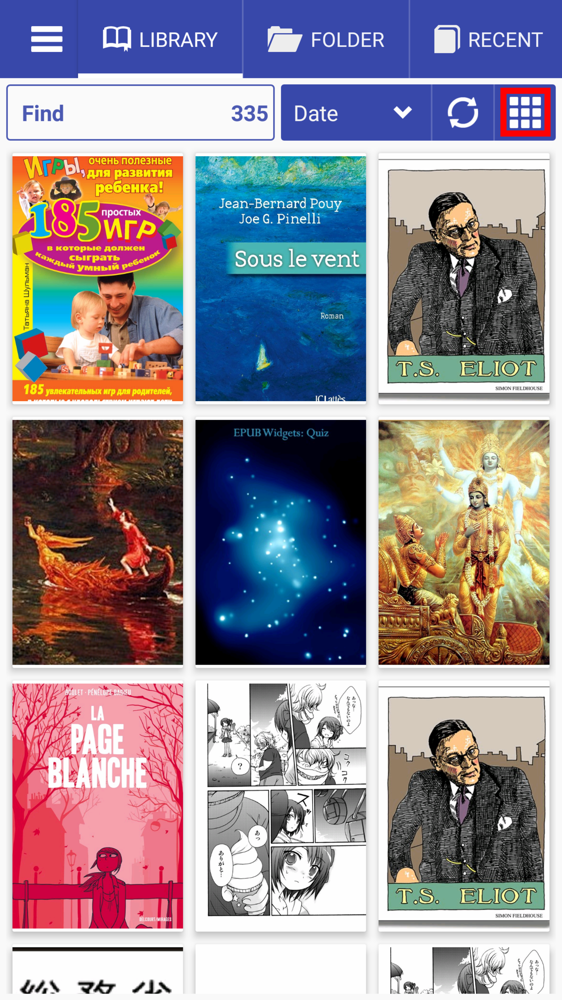|

* Buscar en la biblioteca por la palabra &quot;comm&quot;
* Inicio - para agregar libros a la lista de favoritos
* Largo clic en la estrella para agregar etiquetas personalizadas
* Historia - etiqueta personalizada en el libro
* Mantenga presionado el botón de la tarjeta para abrir el cuadro de diálogo Información del libro.
* Menú del libro

||||
|-|-|-|
|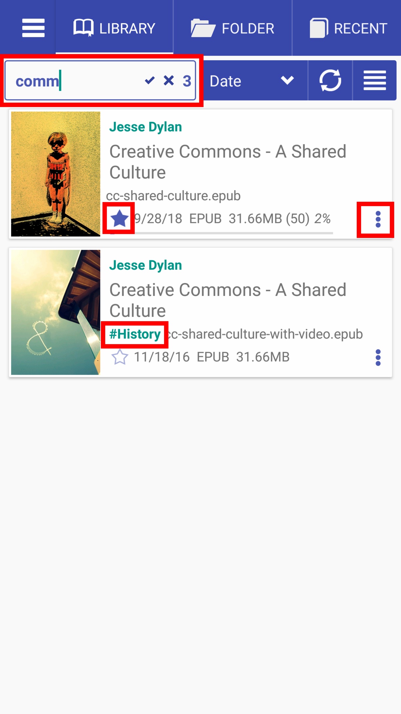|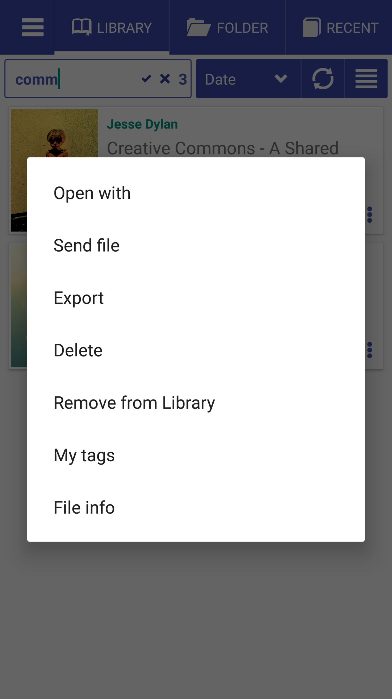|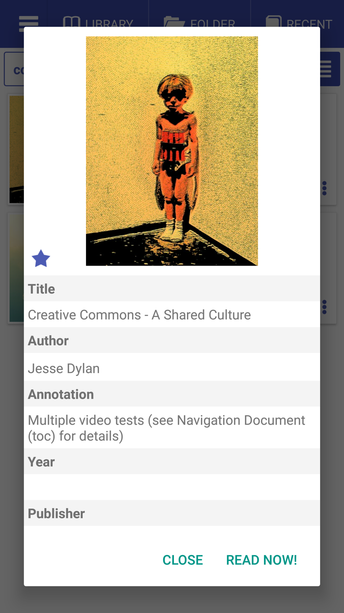|

* Serie de libros, número en serie, búsqueda por FB2
* Haga clic en Autor para encontrar todos los libros por autor.
* Cruzar para borrar la búsqueda en la biblioteca
* Pulsación larga para ver y editar el historial de búsqueda y la finalización automática
* Información del libro y línea de progreso de lectura.

||||
|-|-|-|
|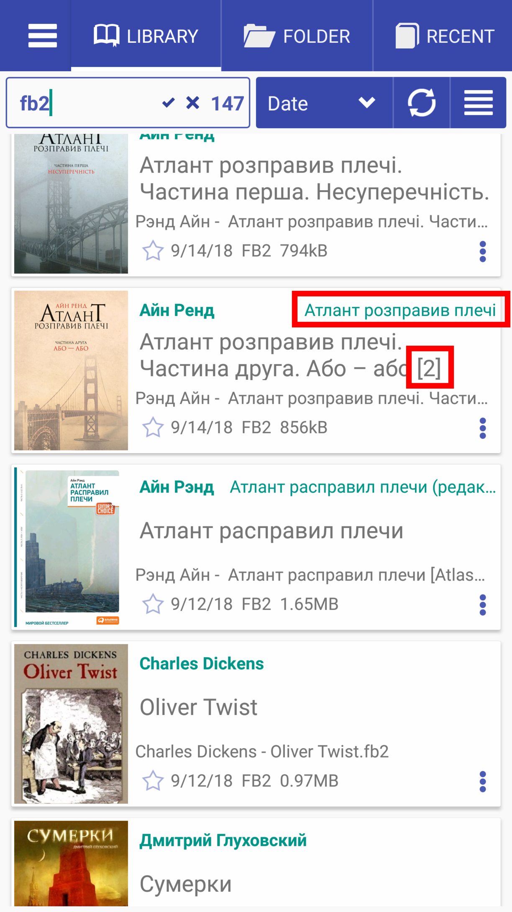|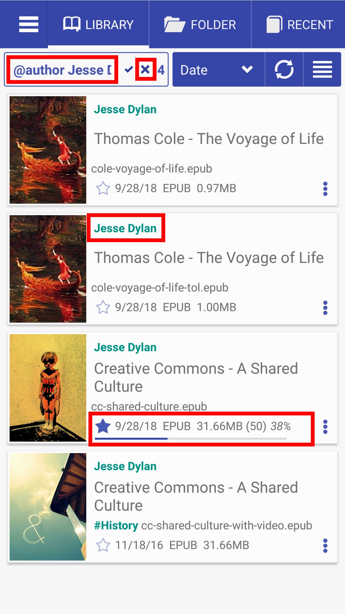|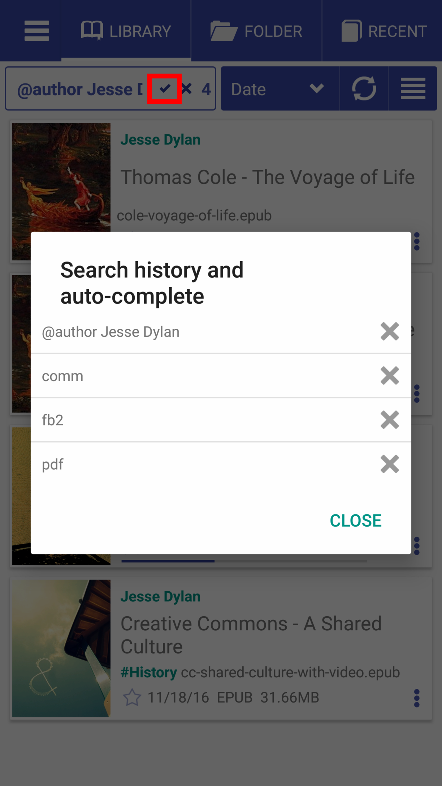|

