[<](/wiki/stories/pt)

# Librera para aprender línguas estrangeiras

> Use o aplicativo muitos alunos e pessoas que lêem livros em diferentes idiomas.
As informações serão úteis para os alunos que estão aprendendo idiomas ou simplesmente lendo livros em outros idiomas.

O aplicativo pode traduzir a palavra ou aplicativo destacado com os atributos.
Os dicionários podem ser um programa em um computador ou dicionários da web.

||||
|-|-|-|
|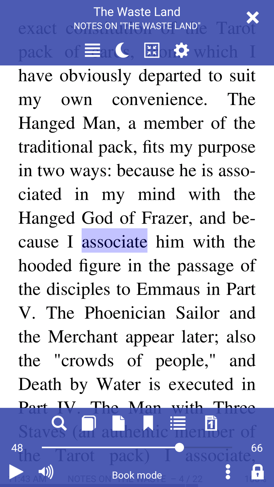|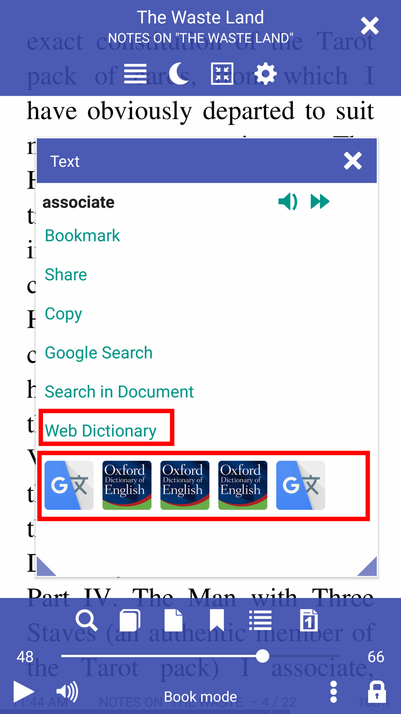|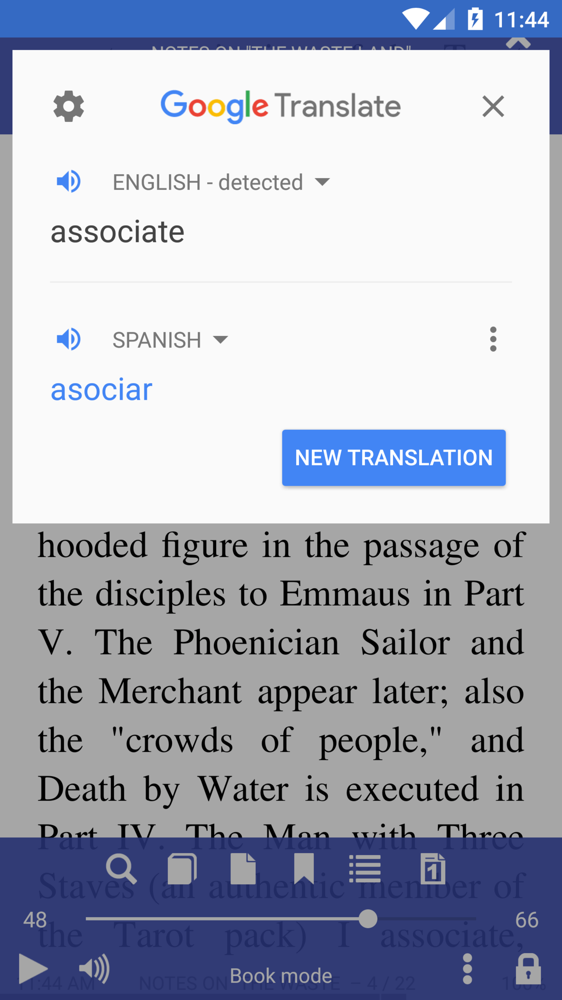|

Você pode ativar a opção para abrir uma palavra conhecida ou uma frase no dicionário selecionado imediatamente.

||||
|-|-|-|
|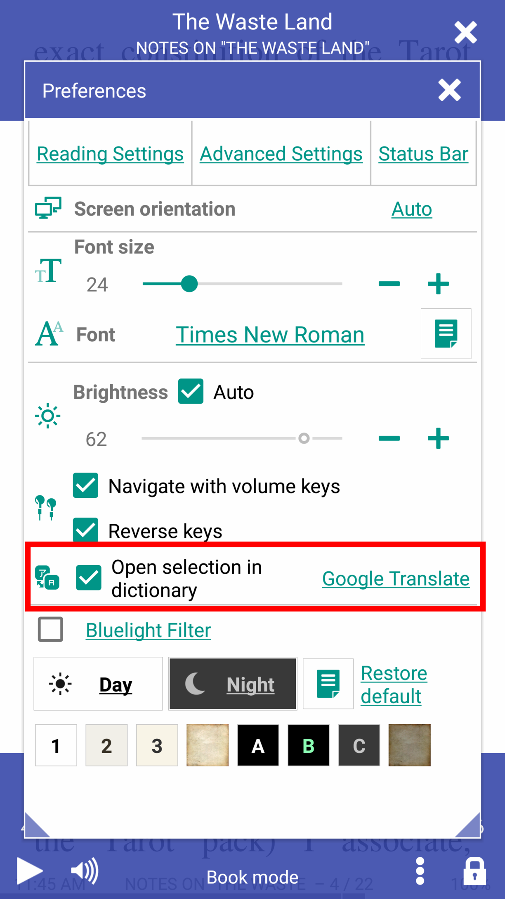||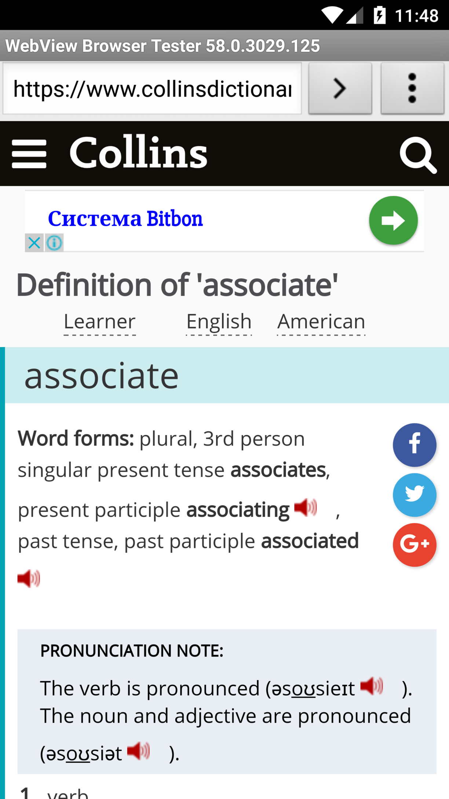|

* Ouça a pronúncia da palavra ou sentença selecionada
* Ouça o livro pela voz
* Adicione palavras e frases às notas.

||||
|-|-|-|
|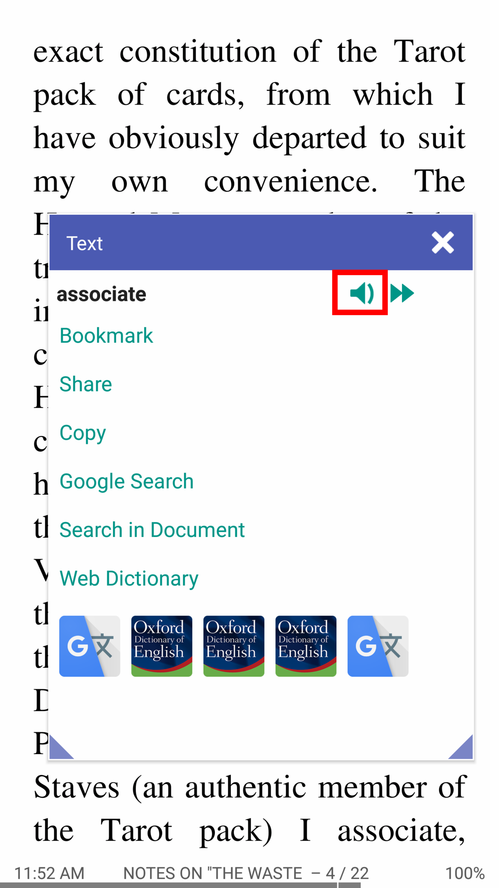|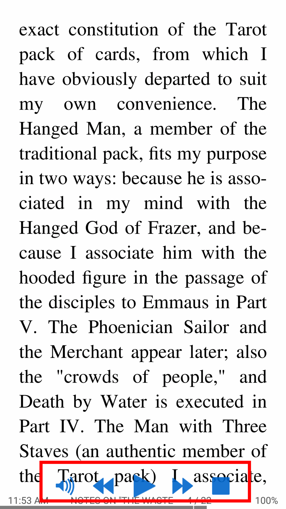|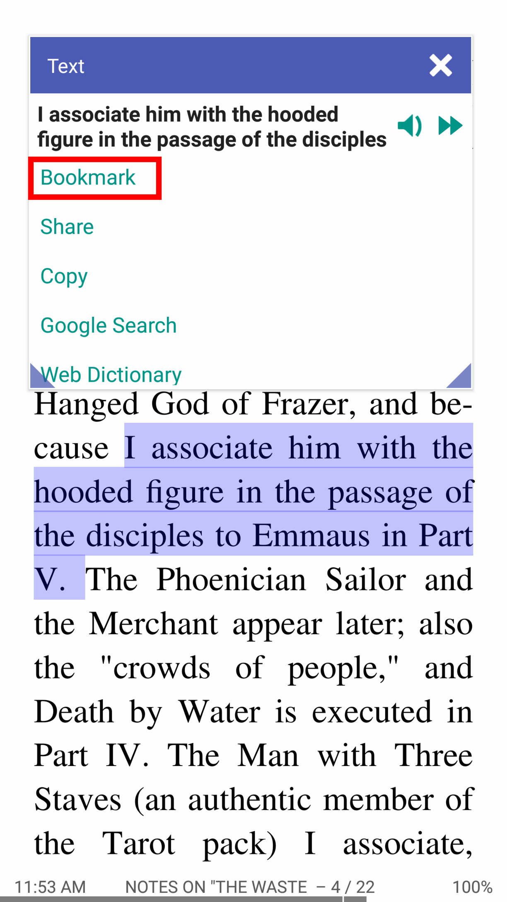|

* Adicione um arquivo audi que vai para o livro
* Ouça o livro pela voz
* Adicione palavras e frases às notas.

||||
|-|-|-|
||||

* Adicione um arquivo audi que vai para o livro
* Gerenciar a escuta, reproduzir-pausar
* Assista todas as suas anotações de livros.

||||
|-|-|-|
|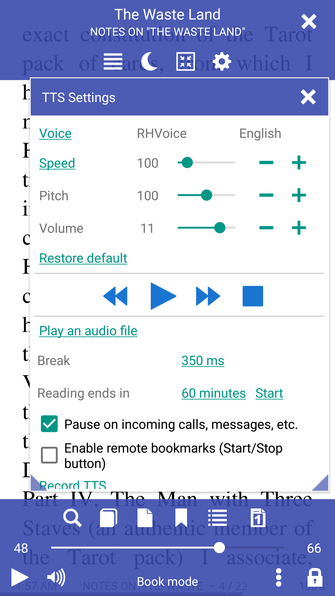|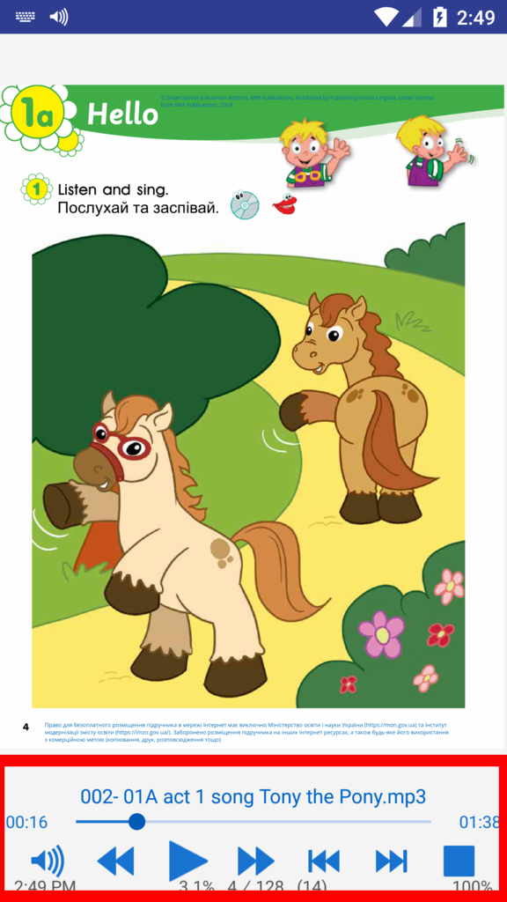|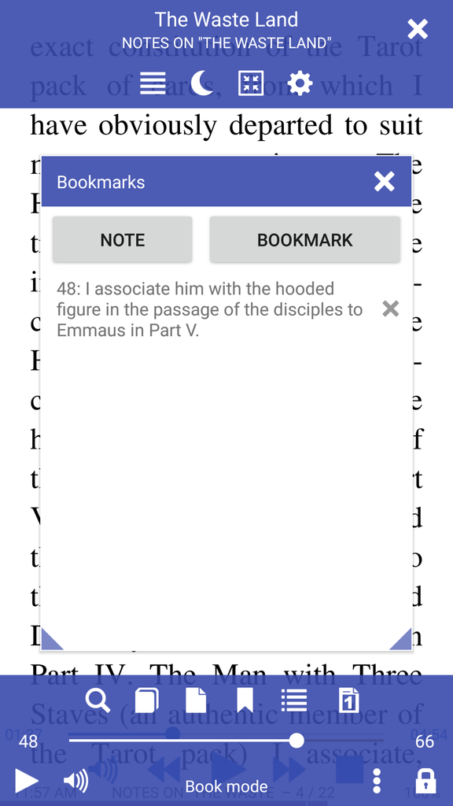|
