# 7.10

* Uma grande atualização baseada nas solicitações e comentários dos leitores
* Nova interface de conversão de texto em fala (TTS)
* Suporte aprimorado para EPUB 3.0, reprodução de arquivos de áudio
* consultas de pesquisa com várias palavras em todos os formatos, incluindo PDF
* Suporte para smartphones entalhados
* A legenda da barra de status agora tem três opções para escolher: completa, compacta e orientada a capítulos
* Mais comentários e solicitações são muito bem-vindos!

Inscreva-se no canal **Librera Reader Telegram** [(https://t.me/LibreraReader))(https://t.me/LibreraReader), notícias, anúncios e muito interessante sobre a nova funcionalidade .

# O que há de novo no Librera 7.10

A janela Configurações do TTS ganhou uma nova aparência e agora funciona melhor em segundo plano.
A leitura TTS suporta pausas ajustáveis (quebras) nos sinais de pontuação.

* controles TTS na parte inferior
* Fácil mudança de velocidade
* Comportamento de notificação aprimorado

||||
|-|-|-|
|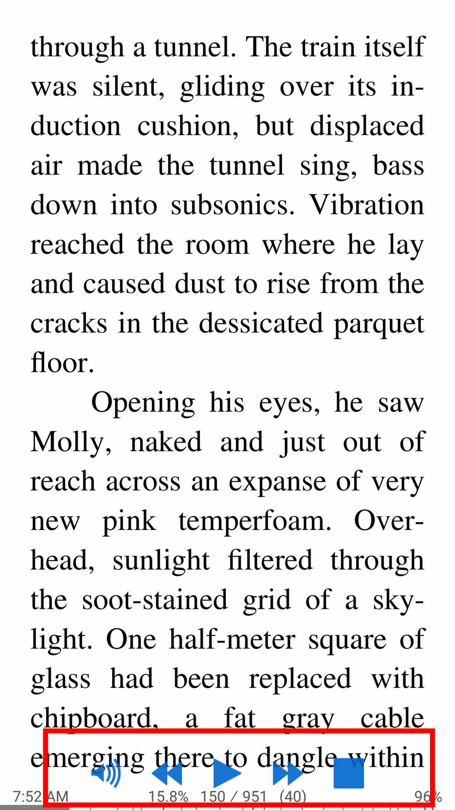|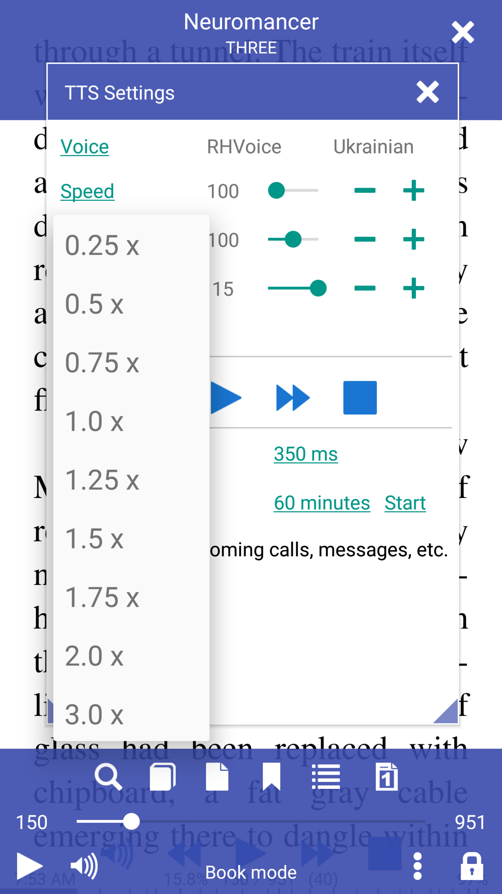|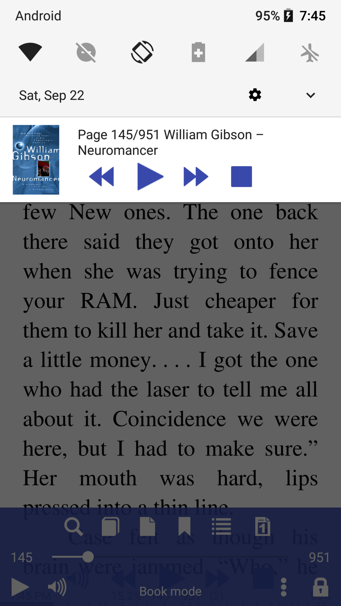|

Pesquise várias palavras em qualquer formato de livro.
A opção &quot;Normalizar tamanho da fonte&quot; faz com que todas as fontes tenham o mesmo tamanho (altura) e reduz os espaços sem quebra para espaços únicos.

* consultas de pesquisa com várias palavras em um livro
* Desativar normalizar tamanho da fonte
* Ativar normalizar tamanho da fonte

||||
|-|-|-|
|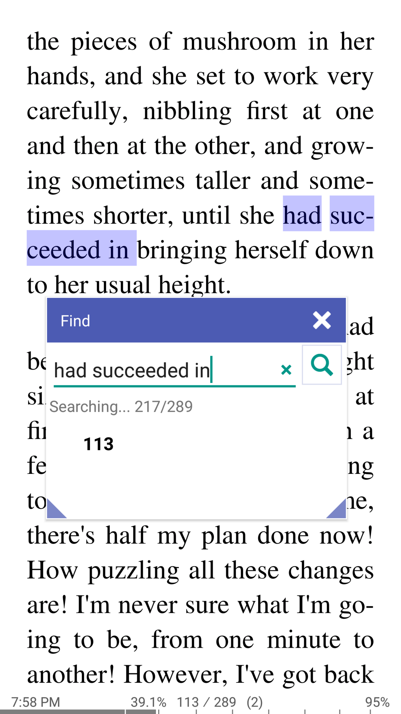|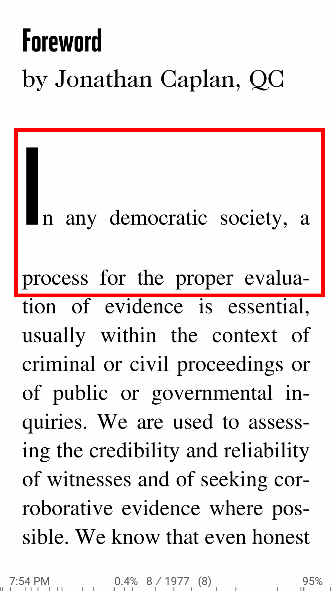|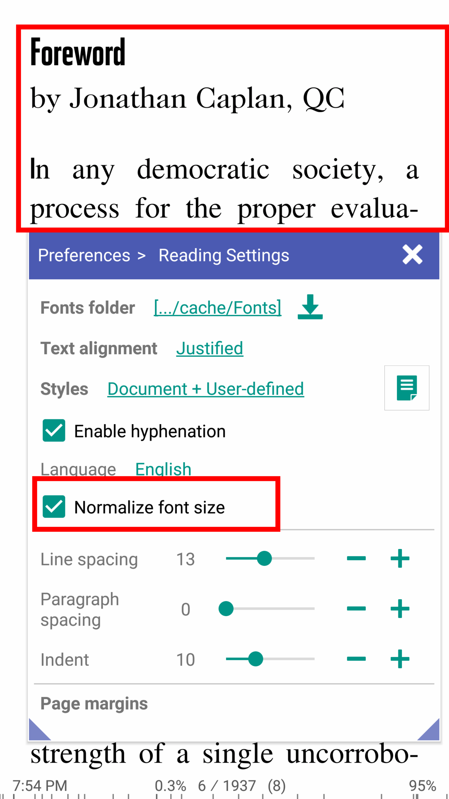|

Abra um arquivo de áudio externo na caixa de diálogo Configurações do TTS e ouça-o enquanto lê.
Esse recurso deve ser útil para quem está aprendendo idiomas estrangeiros ou para músicos.
O Librera player também é uma boa opção para ler livros multimídia.
O formato da legenda da barra de status pode ser alterado de completo para compacto para orientado por capítulo

* Reprodutor de áudio embutido (para reproduzir arquivos de áudio MP3, MP4, FLAC externos enquanto lê um livro)
* Reproduza arquivos de mídia em livros do EPUB3
* Três formatos de legenda da barra de status para escolher

||||
|-|-|-|
|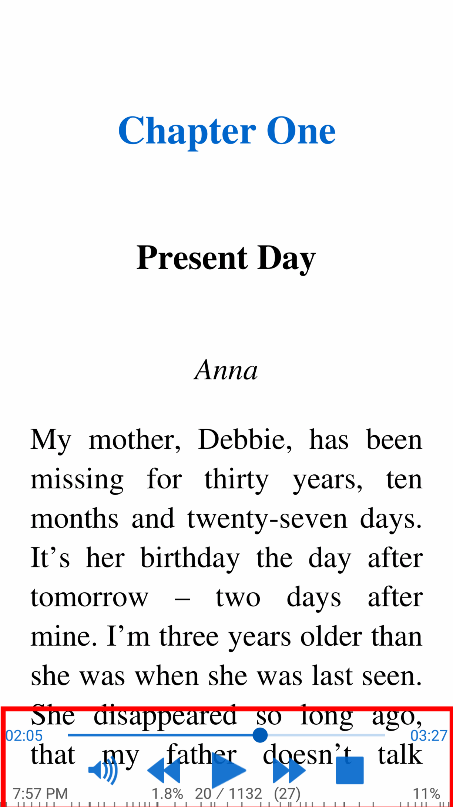|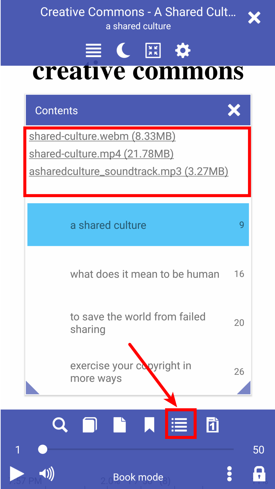|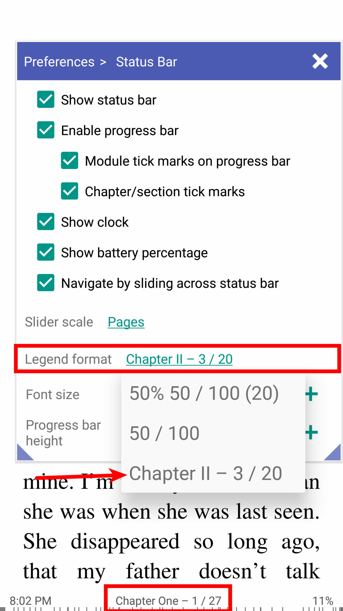|

As iniciais iniciais dos capítulos dos livros do **FB2** podem ser configuradas na caixa de diálogo Configurar fontes.

* Abra a janela Configurar fontes após abrir um livro do FB2
* Habilite e configure as iniciais iniciais
* Você pode alterar a fonte, a cor, o tamanho etc.

||||
|-|-|-|
|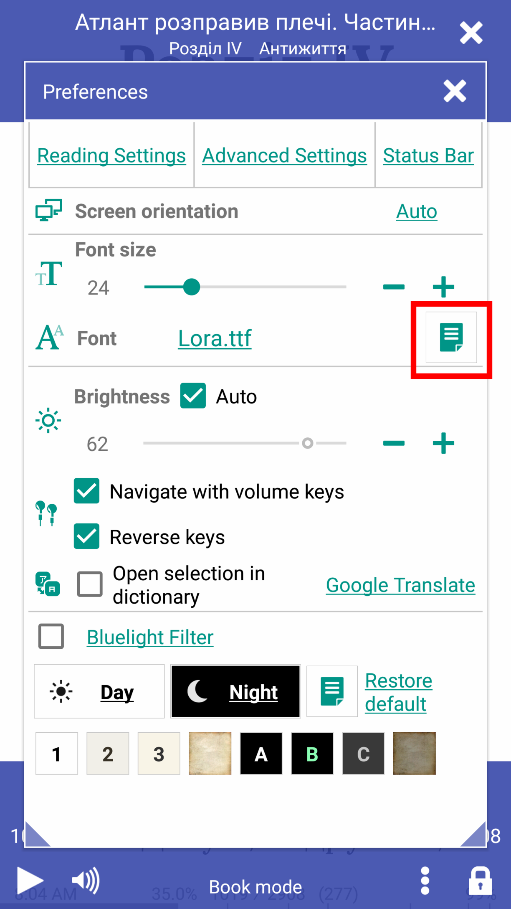|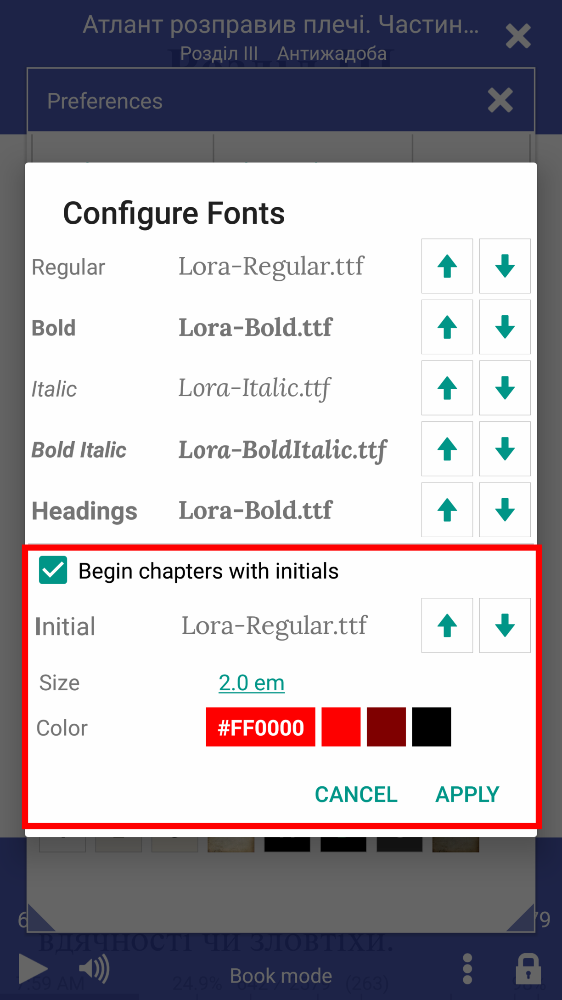||

* Suporte para telefones com visores entalhados
* Sumário dos livros do EPUB 3.0
