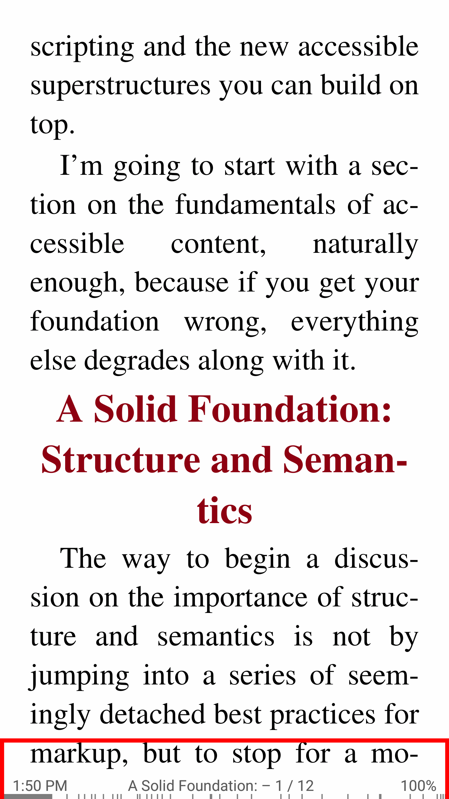
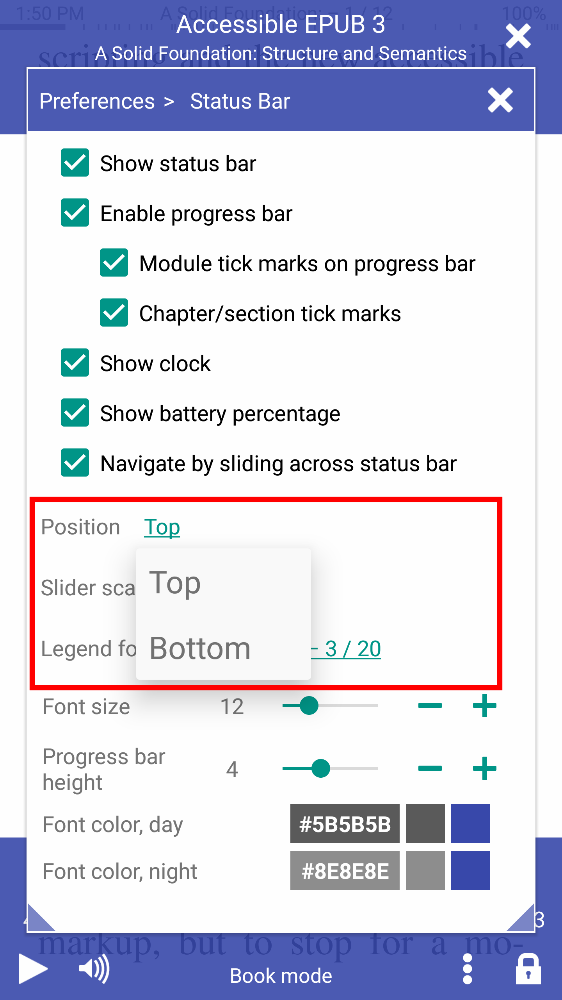
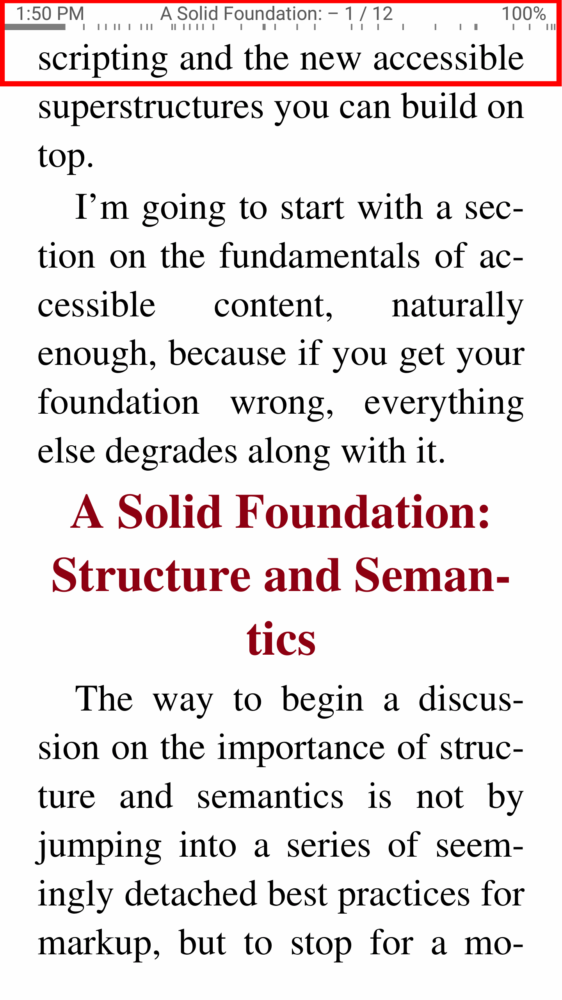

[Что нового](/wiki/what-is-new/ru)

# 7.11

__Новые возможности__

* Режим чтения скорости RSVP (Rapid Serial Visual Presentation/ru) (без завихрения!/ru)
* Выбор текста и поиск в документах DjVu
* Возможность изменения положения строки состояния (сверху или снизу) в режиме книги
* Закладки теперь связаны с прочтением процентных значений прогресса
* Теперь папки можно открыть как книги

__Fixes__

* Создание титульной страницы для больших книг AZW и AZW3
* Значок адаптивного приложения в соответствии с недавними тенденциями Android 8+
* Правила переноса на другие языки
* Чтение TTS прекратится, если ваше устройство Bluetooth отключится

Подпишитесь на канал # # Librera Reader__ Telegram [https://t.me/LibreraReader](https://t.me/LibreraReader). Будьте первыми, кто узнает о наших последних разработках, никогда не пропустите свежие новости, анонсы и другие интересные материалы о новых функциях и функциональности Librera.

__Скоровое чтение RSVP (Быстрая последовательная визуальная презентация)__

Скорость чтения позволяет вам увеличивать скорость чтения до 700 слов в минуту (WPM), считывая страницы по одному слову в строке.
Более подробную информацию вы найдете в разделе [Скорость чтения](/wiki/manual/Rapid-Serial-Visual-Presentation/ru)

* RSVP можно открыть из меню книги
* Один клик, чтобы начать быстрое чтение
* 30 образцов CPL

||||
|-|-|-|
||||

__Станция положения штатива (верхняя или нижняя) в режиме книги__

* Нижняя строка состояния (по умолчанию/ru)
* Изменение настройки позиции
* Верхняя строка состояния

||||
|-|-|-|
||||

__Откройте папку с изображениями в виде книги (Bind in a book)__

Легко открыть любую папку с изображениями, такими как виртуальная книга в приложении Librera.

* Откройте папку с изображениями и привяжите ее в книге
* Папка с изображениями, такими как виртуальная книга
* Добавить границы белой поверхности, контрастность и яркость

||||
|-|-|-|
||||

