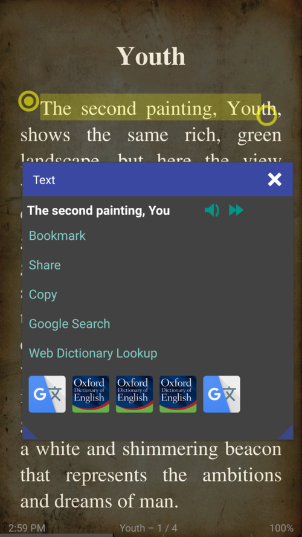

[什么是新的](/wiki/what-is-new/zh)

# 7.11

{6}新功能{6}

{4}选择包含开始和结束标记的文本
* RSVP（快速串行视频演示）速读模式（带扭曲！）
{4}在DjVu文档中选择和搜索文本
{4}可以在书本模式下更改状态栏位置（顶部或底部）
{4}现在，书签与阅读进度百分比值相关联
{4}现在文件夹可以作为书籍打开

{6}修复{6}

{4}大型AZW和AZW3书籍的封面生成
{4}符合最新Android 8+趋势的自适应应用程序图标
{4}更多语言的连字规则
{4}如果您的蓝牙设备断开连接，TTS读数将停止

订阅**Librera Reader**电报频道[https://t.me/LibreraReader](https://t.me/LibreraReader）。成为第一个了解我们最新发展的人，不要错过有关Librera新特性和功能的最新闻，公告和其他有趣的内容。

{6}选择包含开始和结束标记的文本{6}

{4}如果用户选择更多，则单个标记变为可见。
{4}可以按字母{2}或{3}按字{6}选择文字{3}
{4}您可以实时移动标记

||||
|-|-|-|
||||

**RSVP（快速串行视觉演示）阅读/速读{6}

使用**Librera**快速阅读可以将您的阅读速度提高到最高700字/分钟（WPM），实现RSVP方法。
请点击链接查找有关主题的更多信息[速读部分](/wiki/manual/Rapid-Serial-Visual-Presentation/zh)

* RSVP模式可以从书籍菜单启动（速读）
{4}只需轻轻一按即可读取速度
{4}调整最小线长：最高30 CPL

||||
|-|-|-|
||||

书籍模式中的{6}状态栏位置（顶部或底部）{6}

{4}状态栏默认位于底部
{4}从下拉列表中选择其位置
{4}状态栏位于顶部

||||
|-|-|-|
||||

{6}打开带有图像的文件夹（书中绑定）{6}

要将文件夹作为书籍打开，请在“文件夹”选项卡中导航到该文件夹  ，然后点击其名称。如果它至少包含一个图像文件，您将看到“书中绑定”选项。

{4}打开包含图像的文件夹并将其绑定在书中
{4}文件夹w /图像作为虚拟书籍打开
{4}裁剪白色空间，调整对比度和亮度等。

||||
|-|-|-|
||||

# Librera图书阅读器的新功能

* [第7.11版](/wiki/what-is-new/7.11/zh)
* [版本7.10](/wiki/what-is-new/7.10/zh)

