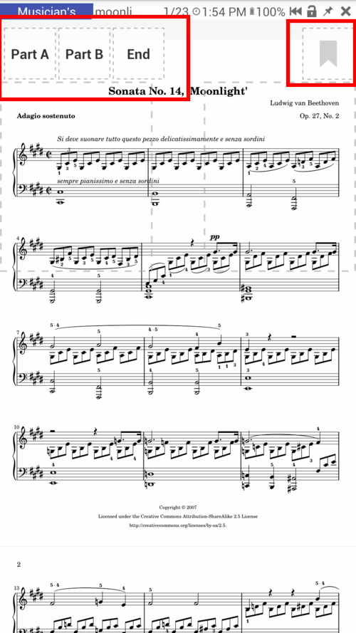
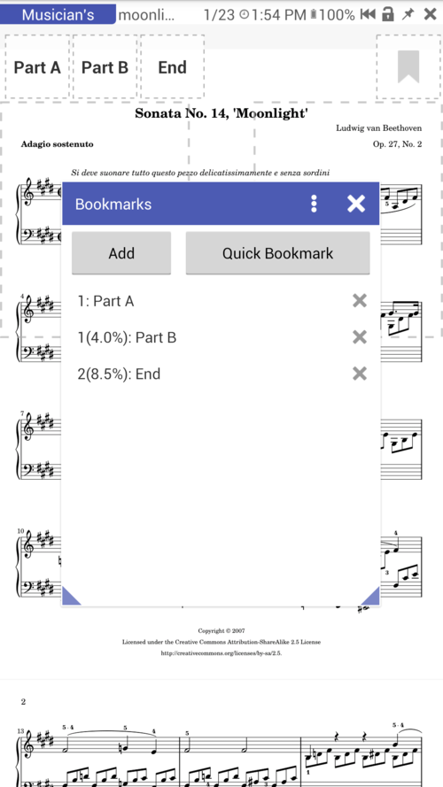
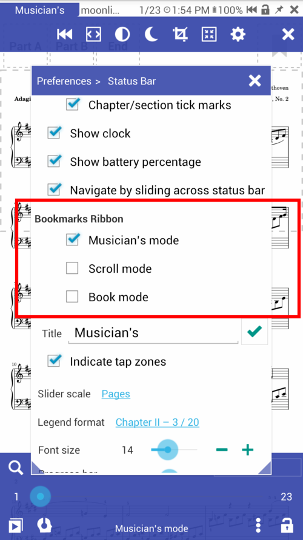
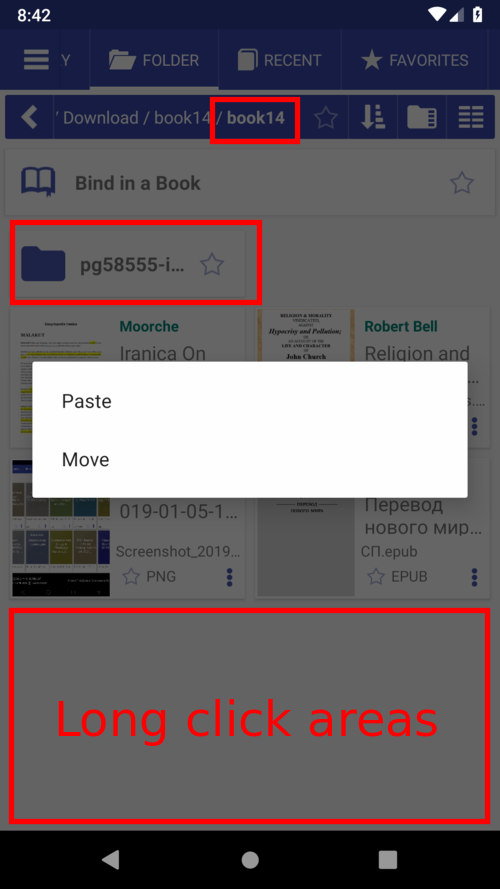
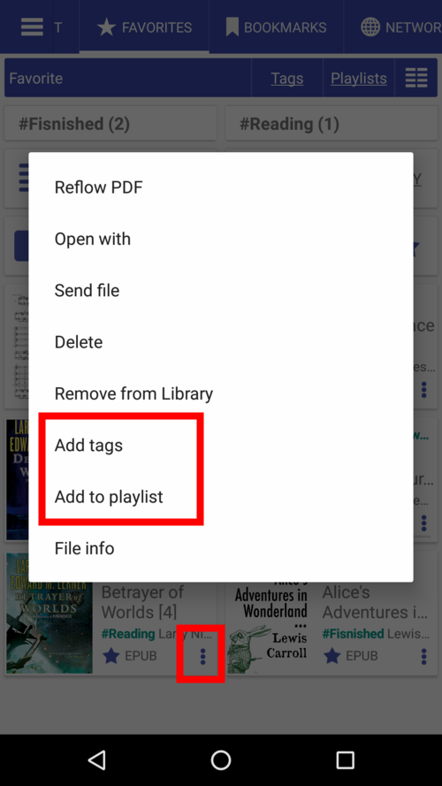
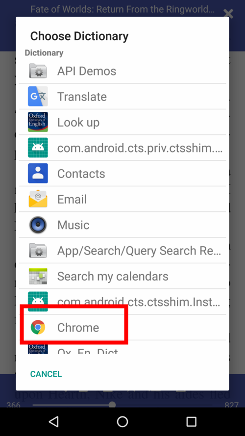
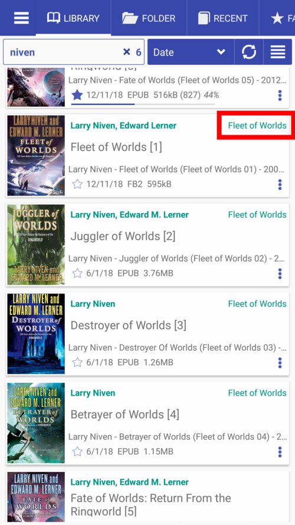
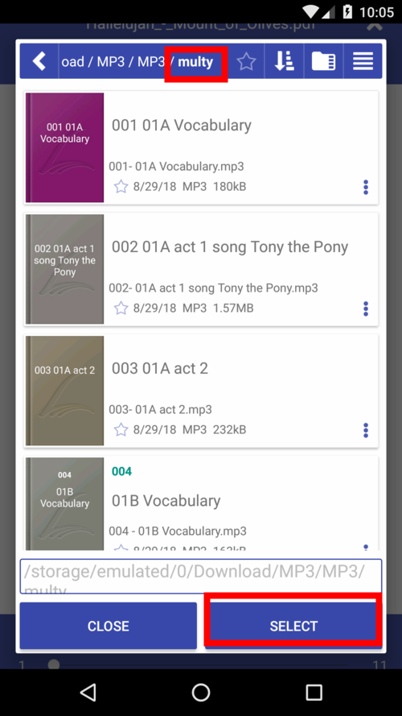
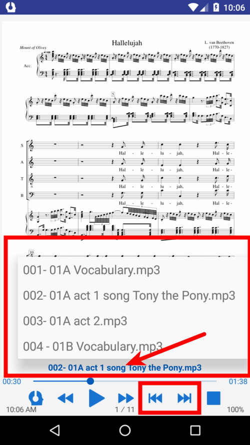

# 7.12

**Новые функции**

* Плейлисты (книжные группировки)
* Добавить приложения (словари) для открытия выделенного текста в текстовом окне
* Воспроизведение mp3 файлов и папок
* серия ручек
* Возможность отображения конечных/сносок в виде текстовых заметок
* TTS теперь может читать конечные/сноски
* Возможность возобновить чтение TTS по последнему знаку препинания (в режиме предложения)
* Поделиться страницами из других приложений (например, браузеров) с Librera Reader
* Поддержка китайского традиционного и упрощенного
* Лента закладок для закладок на лету (например, в режиме музыканта)
* Диспетчер файлов: копирование, вставка и перемещение файлов

**Лента для закладок**

* Добавить закладки одним нажатием
* Удобная навигация по закладкам
* Показать/скрыть ленту в режиме чтения

||||
|-|-|-|
||||

**Копирование, вставка, перемещение файлов в файловом менеджере**

* Копировать любую книгу с книжным меню
* Пастер или переместить книгу в папку
* Нажмите на путь к папке или на черном месте

||||
|-|-|-|
||||

**Закладка**

Вкладка **Избранное** была переработана. **Теги** и **Списки воспроизведения** теперь могут быть легко доступны.
Отметьте книги, чтобы сгруппировать их по общему критерию, например, «Математика», «Триллер», «Тайна» и т. Д. (Тег также можно добавить из окна «Информация о книге».)
Плейлисты предназначены в основном для музыкантов: легко хранить выбранные документы под рукой и манипулировать списком.

||||
|-|-|-|
||||

**Плейлисты**

* Создание плейлистов
* Перетащите за ручки, чтобы изменить порядок книг
* Проведите пальцем вправо/влево, чтобы удалить книгу из списка
* Нажмите «Изменить», чтобы внести изменения в список.

||||
|-|-|-|
||||

**Добавить приложения пользователя**

Нажмите **+**, чтобы добавить приложение, которое откроет выделенный текст

||||
|-|-|-|
||||

**Серия книг по обращению**

Все книги в серии легко найти:

* Серия «кликабельна» в карточке книги
* Применение фильтра серии к библиотеке книг
* Все книги серии будут перечислены в окне «Информация о книге».

||||
|-|-|-|
||||

**Воспроизведение mp3 файлов**

Слушайте mp3-файл или выбор файла через внутренний проигрыватель параллельно с чтением книги.
Может быть полезно для музыкантов и для тех, кто изучает иностранные языки.

||||
|-|-|-|
||||

