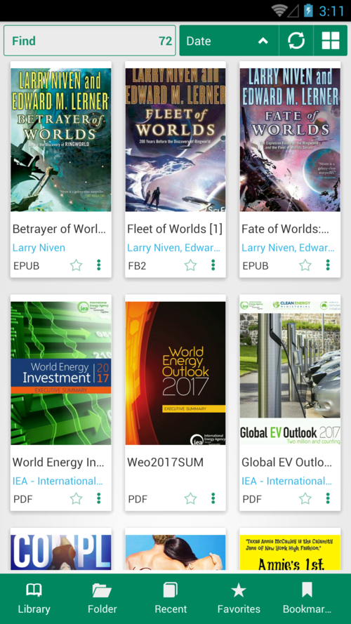

[What Is New](/wiki/what-is-new)

# 8.0

**New Features**

* Migrate to Android Studio (https://github.com/foobnix/LibreraReader)
* Update all libraries up to date
* Improved Dark Theme
* Doc format support
* Docx format support for Anroid 8+

**Taps positoin - top or bottom**

||||
|-|-|-|
||||

# What is new in Librera Book Reader

* [Version 7.12](/wiki/what-is-new/7.12/)
* [Version 7.11](/wiki/what-is-new/7.11/)
* [Version 7.10](/wiki/what-is-new/7.10/)
