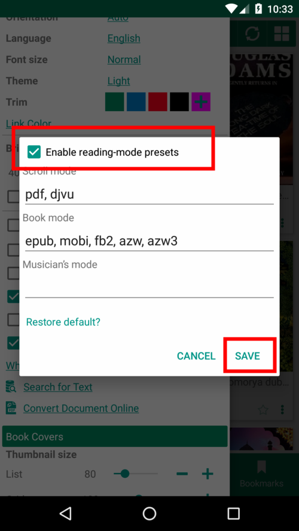
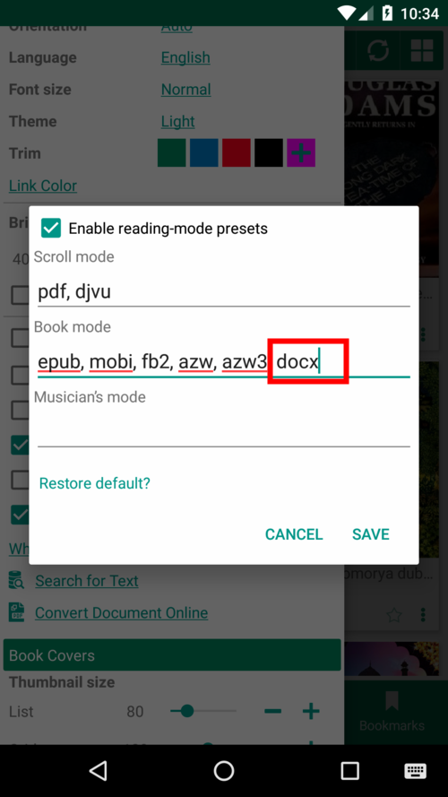
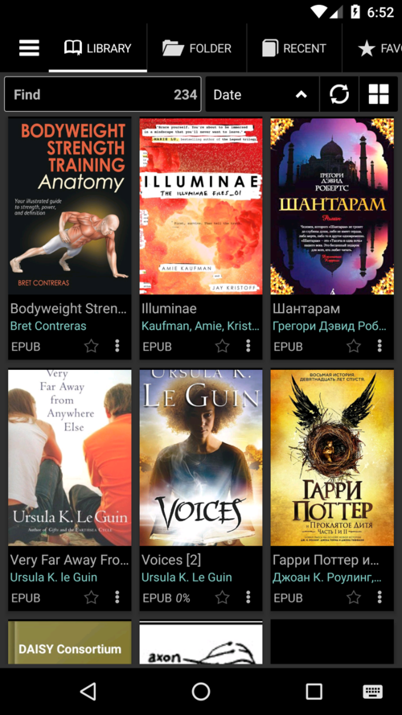
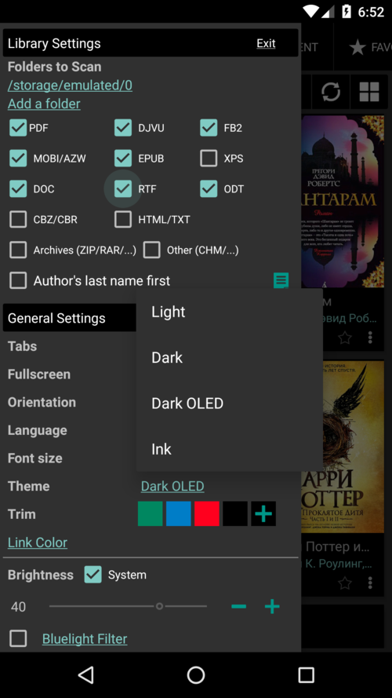

[Cosa c'è di nuovo](/wiki/what-is-new/it)

# 8.0

**Miglioramenti generali**

* Tutte le librerie sono state aggiornate
* Il tema scuro è stato migliorato

**Nuove funzionalità**

* Opzione per cambiare la posizione delle schede
* Supporto per il formato del documento
* Supporto per il formato Docx su dispositivi Anroid 8+
* Preset in modalità lettura

**Correzioni di bug**

* File e cartelle eliminati non più _ghost_ Library
* I file, aperti da altre app, rimarranno nella Libreria fino all'eliminazione (e la cache cancellata)

**Scegli la posizione delle schede: superiore o inferiore**

||||
|-|-|-|
||||

**Preset in modalità lettura**

* Dì a **Librera** quale modalità di lettura predefinita si preferisce per un particolare formato di libro
* Aggiungi manualmente qualsiasi formato desiderato

||||
|-|-|-|
||||

**Temi OLED scuri e scuri**

* Scegli il tema OLED scuro con colore nero come la pece

||||
|-|-|-|
||||

# Cosa c'è di nuovo in Librera Book Reader

* [Versione 7.12](/wiki/what-is-new/7.12/it)
* [Versione 7.11](/wiki/what-is-new/7.11/it)
* [Versione 7.10](/wiki/what-is-new/7.10/it)
