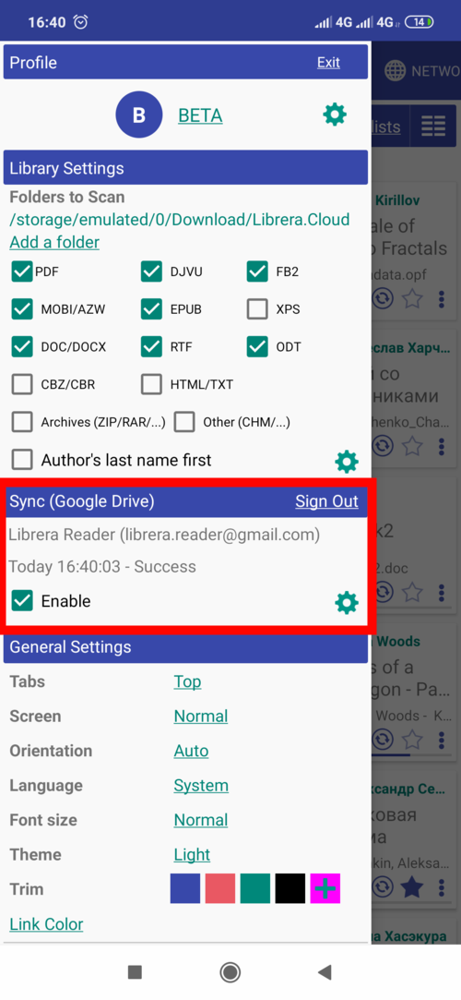
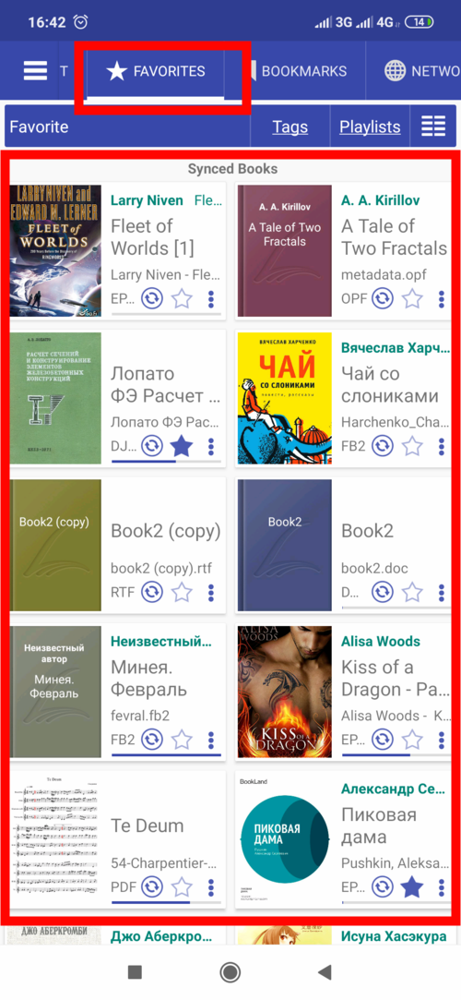
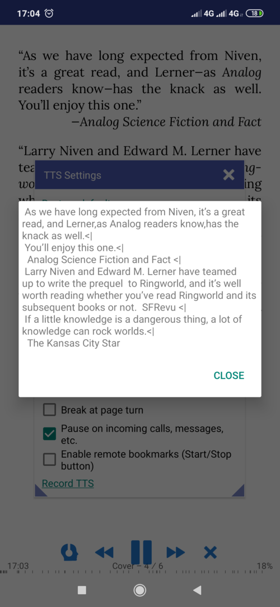
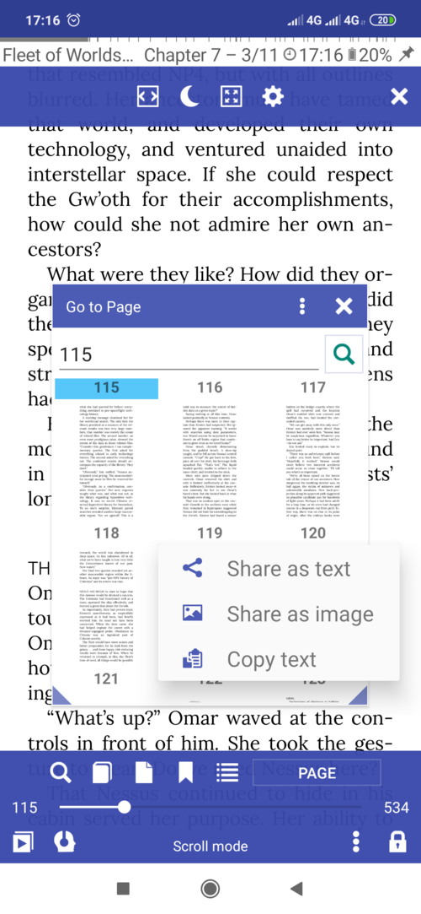
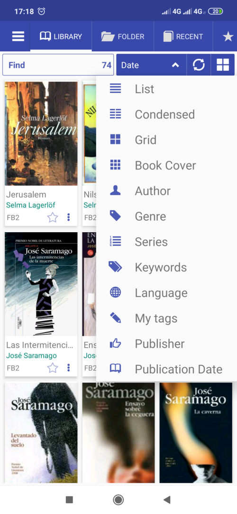

[ما الجديد](/wiki/what-is-new/ar)

# 8.1

باستخدام هذا التطبيق ، فإنك توافق على شروط [سياسة الخصوصية](/wiki/PrivacyPolicy/ar)

**ميزات جديدة**

* المزامنة مع Google Drive (تقدم ، إشارات مرجعية ، كتب)
* لمحات
* الاستبدالات وعلامات الإجهاد وقواعد RegEx في TTS
* المزيد من الإعدادات في وضع Musician

# المزامنة مع Google Drive

تتيح لك المزامنة مزامنة كل شيء في السحابة وقراءة نفس الكتاب على العديد من الأجهزة
مع توفير التقدم. المزامنة إذا كانت مجانية في جميع تطبيقات Librera.

* مزامنة قراءة تقدم جميع الكتب (متزامنة وغير متزامنة) إذا كان يمكنك استخدام نفس اسم الكتاب في كتب أخرى
سيتم مزامنة تقدم الأجهزة تلقائيًا
* مزامنة الإشارات المرجعية
* مزامنة القائمة الحديثة
* مزامنة الكتب والعلامات المفضلة

أمثلة المزامنة

* تمكين المزامنة مع Google Drive
* انقر على قائمة الكتاب لمزامنة الكتاب
* جميع الكتب التي تمت مزامنتها في علامة التبويب المفضلة

||||
|-|-|-|
||||
 
 
# لمحات

التشكيلات الجانبية مثل تثبيت تطبيق منفصل مع إعدادات مختلفة ، والكتب ، وتقدم الكتاب ، والإشارات المرجعية.
يمكنك إنشاء وحذف ملفات التعريف. تستخدم جميع تطبيقات Librera ملفات التعريف نفسها في جميع التطبيقات.
الملفات الشخصية المخزنة في ذاكرة الجهاز الداخلية/بطاقة الذاكرة/المكتبة/الملف الشخصي.
في هذا المجلد ، كل الإعدادات والإشارات المرجعية والتقدم المخزن في ملفات json.
يمكنك مشاهدته ولكن لا تقم بتعديله يدويًا.

**النقر الطويل** على اسم الملف الشخصي سيظهر مربع الحوار لاستعادة الإعدادات الافتراضية (الإشارات المرجعية والتقدم غير واضح)

||||
|-|-|-|
||||

# الاستبدال في TTS

* تمكين &quot;Repalces&quot; ثم قم بإضافة القواعد.
* إضافة قاعدة لاستبدال كل الأحرف في القائمة بواحدة أخرى &quot;[/.،]&quot; -&gt; &quot;&quot;
* استبدل كلمة واحدة بكلمة &quot;lib&quot; -&gt; &quot;Librera&quot;
* إضافة علامات الإجهاد (إذا كان محرك TTS يدعمها) &quot;Librera&quot; -&gt; &quot;Libréra&quot;
* عرض نص النتيجة مع الاستبدال في مربع الحوار
* الدعم الخارجيVoice Aloud .txt RegEx يستبدل الملف

||||
|-|-|-|
||||

# المزيد من الإعدادات في وضع Musician

* إظهار/إخفاء مستطيلات مناطق النقر
* قم بتمييز الصفحة الأخيرة بخطوط حمراء (صغيرة وكبيرة)
* تمييز فواصل الصفحات
* انقر فوق الصفحة التالية في الصفحة الأخيرة انتقل إلى الصفحة الأولى
* انقر مرة أخرى على الصفحة الأولى للانتقال إلى الصفحة الأخيرة

||||
|-|-|-|
||||

# تحسينات واجهة المستخدم

* مشاركة/نسخ الصفحة كنص imge \ text (نقرة طويلة على معاينة الصفحة)
* دعم شاشات مسننة (انقطاع)
* ترتيب الكتب بحسب **الناشر** و **تاريخ النشر**

||||
|-|-|-|
||||

# الآخرين

* دعم MathML و SVG (تمكين في الخيارات المتقدمة ، تحميل الكتاب الأول بطيء جدًا)
* خيار المكتبة لتجاهل جلب بيانات التعريف من الكتب
* كلمة مرور الإصبع لفتح التطبيق (Android 9+)
* قم بتعيين إيقاف تشغيل مهلة الشاشة بالدقائق أو قيمة النظام


 
