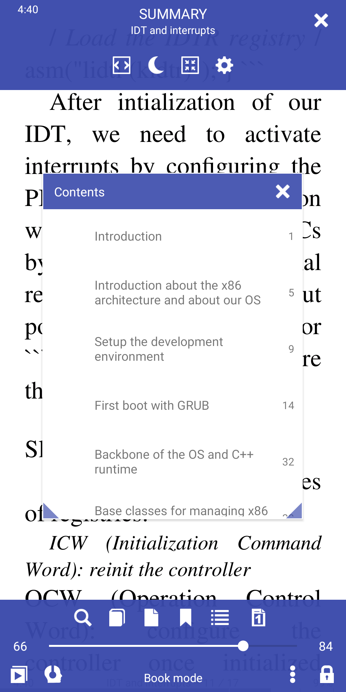
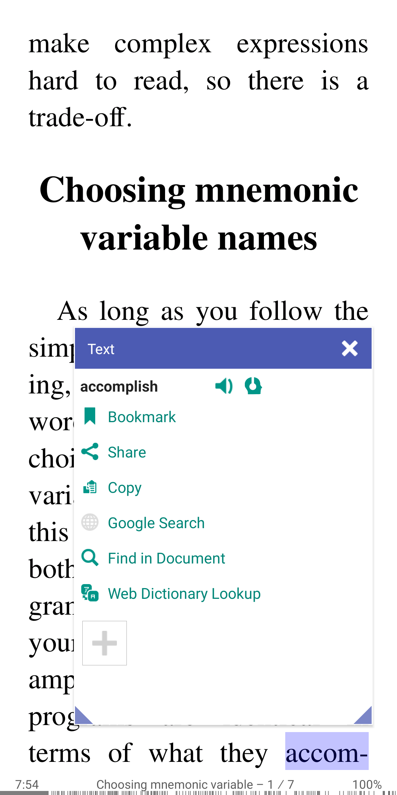
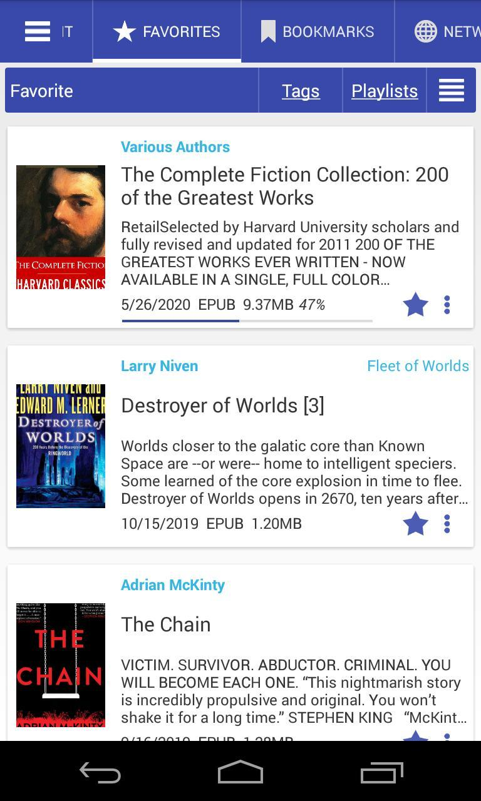
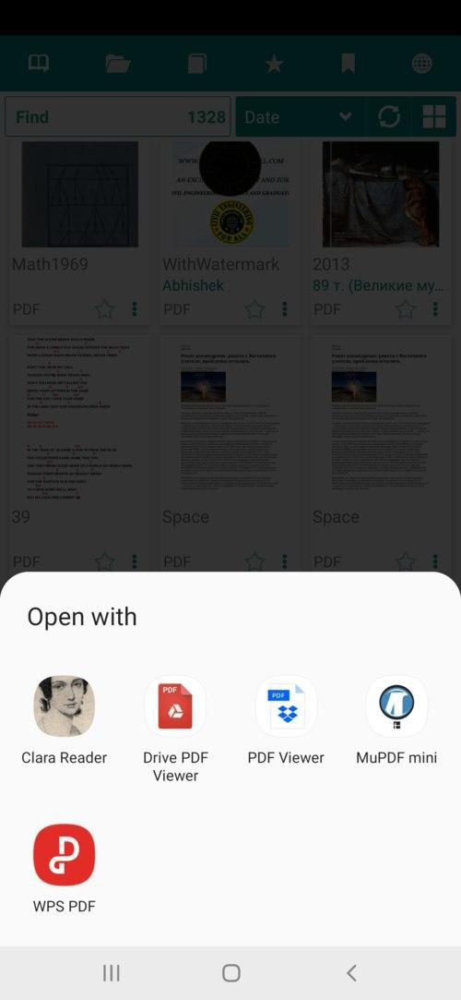
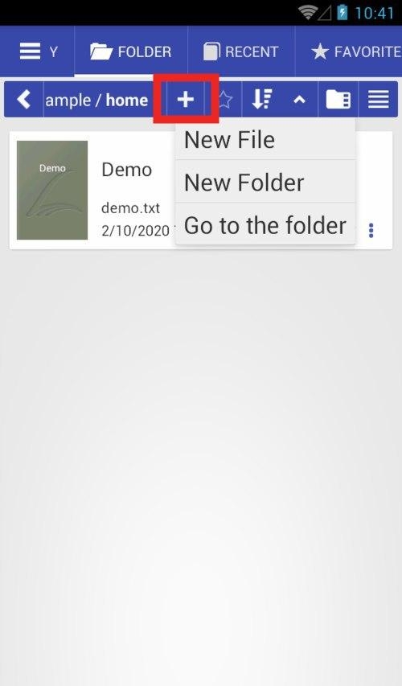

# ما الجديد (محدث)

### [8.3.97] تمكين تعطيل تكامل قائمة السياق (اختيار النص)

|||
|-|-|
|||

### [8.3.94] ربط GitBook

|||
|-|-|
|||

### [8.3.90] تحسين إمكانية الوصول

### [8.3.84] تنسيق مجلد تنزيل OPDS &quot;[اسم المؤلف]/اسم الكتاب&quot;

### [8.3.80] اختيار النص: سيتم تحديد الكلمة الأخيرة الواصلة في الصفحة على أنها مكتملة

### [8.3.78] لغة واصلة افتراضية لجميع الكتب

### [8.3.77] صورة طبق الأصل للكمبيوتر عن بعد

||||
|-|-|-|
||||

### [8.3.70] إظهار وصف الكتاب

|||
|-|-|
|||

### [8.3.58] عدد الكتب في المجلد

### [8.3.49] إجراء &quot;فتح باستخدام&quot; الافتراضي لفتح الكتاب

|||
|-|-|
|||

### [8.3.41] علامات التبويب &quot;الرموز فقط&quot;

||||
|-|-|-|
||||

### [8.2.37] ملف جديد ، مجلد جديد ، انتقل إلى خيارات المجلد

### [8.2.36] مسار تعديل &quot;الانتقال إلى المجلد&quot; (نقرة طويلة)

### [8.2.22] الوضع المرجعي كما في عرض العيار

|||
|-|-|
|||

### [8.2.21] الدعم الأساسي لملفات .md Markdown

### [8.2.20] أرسل الصفحة كنص/صورة من مربع حوار الانتقال إلى الصفحة.

### [8.2.19] تحديد تنسيقات الكتاب لأوضاع القراءة (الإعدادات المسبقة لوضع القراءة)

